# Acceso a equipos remotos

Principalmente existen dos escenarios al acceder una computadora remota. La diferencia entre estos escenarios radica especialmente en la respuesta a una pregunta: ¿Puede WinRM identificar y autenticar la máquina remota?

Obviamente, la máquina remota necesita saber quién es usted, porque estará ejecutando comandos en su nombre. Pero usted necesita saber quién es, también. Esta autenticación mutua, es un paso de seguridad importante. Significa que cuando escribe SERVER2, se está conectando realmente con el SERVER2 real, y no con alguna máquina haciéndose pasar por SERVER2. Mucha gente ha publicado artículos de blog sobre cómo deshabilitar las verificaciones de autenticación. Hacerlo, hace que Remoting " funcione" y se deshaga de los molestos mensajes de error, pero abre brechas de seguridad y hace posible que alguien "secuestre" o "falsifique" su conexión y potencialmente capture información confidencial como sus credenciales
.

**Precaución:** Tenga en cuenta que Remoting implica delegar una credencial en el equipo remoto. Usted está haciendo algo más que simplemente enviar un nombre de usuario y una contraseña \(que en realidad no ocurre todo el tiempo\). Está dando a la máquina remota la capacidad de ejecutar las tareas como si estuviera allí ejecutándolas usted mismo. Un impostor podría hacer mucho daño con ese poder. Es por eso que Remoting se enfoca en la autenticación mutua, para que los impostores no tengan esa oportunidad.

En los escenarios de Remoting más sencillos, usted se conecta a una máquina que está en el mismo dominio de AD utilizando su nombre de equipo real, tal como está registrado en AD. AD maneja la autenticación mutua y todo funciona de maravilla. Pero las cosas se pueden poner un poco más difíciles en otros escenarios:

* Conectar a una máquina en otro dominio
* Conectar a una máquina que no está en un dominio en absoluto
* Conectarse a través de un alias de DNS, o a través de una dirección IP, en lugar de a través del nombre de equipo real de la máquina como está registrado con AD

En estos casos, AD no puede hacer la autenticación mutua, por lo que tendrá que hacerlo usted mismo. En este punto tiene dos opciones:

* Configurar la máquina remota para aceptar conexiones HTTPS \(en lugar de HTTP\) y equiparla con un certificado SSL. El Certificado SSL debe ser emitido por una Autoridad de Certificación \(CA\) en la que confíe la máquina. Esto permite que el certificado SSL proporcione la autenticación mutua que WinRM usara luego.
* O, agregar el nombre de la máquina remota \(lo que esté especificando, ya sea un nombre de equipo real, una dirección IP o un alias CNAME\) a la lista de WinRM TrustedHosts de su equipo local. Tenga en cuenta que esto básicamente inhabilita la autenticación mutua, ya que permite a WinRM conectarse con ese identificador \(nombre, dirección IP o lo que sea\) sin utilizar la autenticación mutua. Esto abre la posibilidad para que una máquina pretenda ser la que usted desea, así que es mejor que tenga la debida precaución.

En ambos casos, también debe especificar un parámetro -Credential en el comando Remoting, aunque sólo esté especificando la misma credencial que está utilizando para ejecutar PowerShell. Cubriremos ambos casos en las siguientes dos secciones.

**Nota:** A lo largo de esta guía, usaremos "Comando Remoting" para referirnos genéricamente a cualquier comando que implique la creación de una conexión Remoting. Estos incluyen \(pero no se limitan a\) New-PSSession, Enter-PSSession, Invoke-Command, y así sucesivamente.

## Configuración de un HTTPS Listener

Esta es una de las cosas más complejas que puede hacer con Remoting, e implicará ejecutar una gran cantidad de utilitarios externos. Lo siento - es sólo que así se hace- En este momento no parece haber una manera fácil de hacer esto totalmente desde PowerShell, o al menos no la hemos encontrado. Algunas cosas, podrían hacerse a través de PowerShell, pero como resulta más fácil hacerlo de otra forma, así lo he hecho.

El primer paso es identificar el nombre del host que la gente utilizará para acceder a su servidor. Esto es muy, muy importante, y no es necesariamente lo mismo que el nombre de equipo real del servidor. Por ejemplo, la gente que accede a "www.ad2008r2.loc" podría estar golpeando un servidor llamado "DC01", pero el certificado SSL que creará debe ser emitido para el nombre de host "www.ad2008r2.loc" porque eso es lo que la gente estará escribiendo Por lo tanto, el nombre del certificado debe coincidir con el nombre que la gente va a escribir para llegar a la máquina - incluso si es diferente de su verdadero nombre de equipo. ¿Lo tiene?

**Nota:** Nota: Parte de la configuración de un listener de HTTPS es obtener un certificado SSL. Utilizaré una Autoridad de Certificación \(CA\) pública llamada DigiCert.com. También puede usar una PKI interna, si su organización tiene una. No recomiendo usar MakeCert.exe, ya que los equipos que intentan conectarse no pueden confiar implícitamente en dicho certificado. Me doy cuenta de que cada blog en el universo le dice que use MakeCert.exe para crear un certificado auto-firmado local. Sí, es fácil, pero está mal. Usarlo requiere que apague la mayor parte de la seguridad de WinRM, así que ¿por qué molestarse con SSL si planea apagar la mayoría de sus características de seguridad?

También necesita asegurarse de conocer el nombre completo usado para conectar con una computadora. Si la gente tiene que escribir "dc01.ad2008r2.loc", entonces eso es lo que debe aparecer en el certificado. Si simplemente necesita digitar "dca", y saber que un DNS puede resolver eso a una dirección IP, entonces "dca" es lo que debe llevar el certificado. Estamos creando un certificado que solo dice "dca" y debemos asegurarnos que nuestros equipos puedan resolver eso a una dirección IP.

#### Creación de una solicitud de certificado

A diferencia de IIS, PowerShell no ofrece una forma amigable y gráfica de crear una Solicitud de Certificado (de hecho no ofrece ninguna). Entonces, vaya a [http://DigiCert.com/util](http://DigiCert.com/util) y descargue su versión gratuita del “Utilitario para certificados”. La Figura 2.1 muestra el utilitario. Tenga en cuenta el mensaje de advertencia.

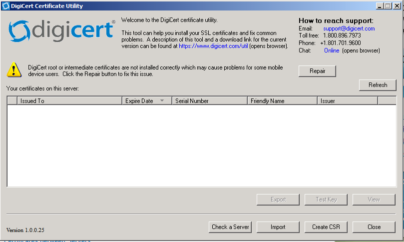

Figura 2.1: Ejecutando DigiCertUtil.exe

Sólo tiene que preocuparse por la advertencia si planea adquirir su certificado de la CA de DigiCert. Haga clic en el botón Repair para instalar los certificados intermedios en su computadora, permitiendo que su certificado sea confiable y se pueda utilizar. La figura 2.2 muestra el resultado de hacerlo. Una vez más, si planea llevar la Solicitud de Certificado \(CSR\) eventual a una CA diferente, no se preocupe por el botón Repair o por el mensaje de advertencia

**Nota** También puede abrir una consola MMC en blanco y agregar el complemento "Certificados" de Windows. Cuando se le solicite, agregue la “cuenta de equipo” para el equipo local. A continuación, haga clic con el botón derecho en la carpeta "Personal" y seleccione Todas las tareas para encontrar la opción para crear una nueva solicitud de certificado.  
:  
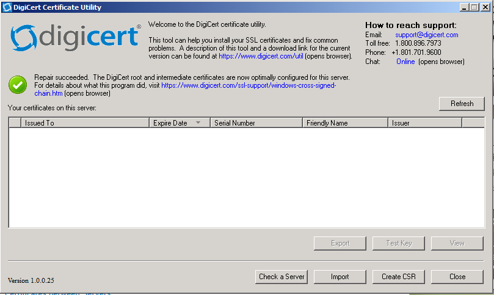

Figura 2.2: Después de agregar los certificados intermedios de DigiCert

Haga clic en " Create CSR". Como se muestra en la figura 2.3, complete la información sobre su organización. Esto tiene que ser exacto: El "nombre común" es exactamente lo que la gente escribirá para acceder al equipo en el que se instalará este certificado SSL. Podría ser simplemente "dca", en nuestro caso, o "dc01.ad20082.loc" si se necesita un nombre completo, y así sucesivamente. El nombre de su empresa también debe ser preciso: la mayoría de las CA verificarán esta información.

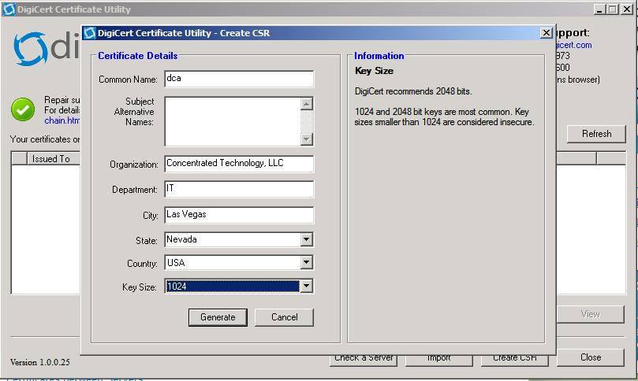

Figura 2.3: Diligenciar el CSR

Por lo general, se guarda la CSR en un archivo de texto, como se muestra en la figura 2.4. También puede copiarlo en el Portapapeles. Cuando vaya a su CA, asegúrese de que está solicitando un certificado SSL \("Servidor Web", en algunos casos\). Un certificado de correo electrónico u otro tipo no funcionará.

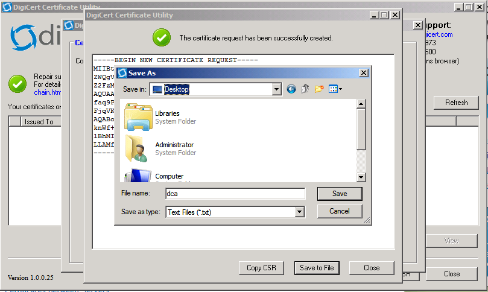

Figura 2.4: Guardar el CSR en un archivo de texto

A continuación, lleve esa CSR a su CA y solicite su certificado. Verá algo como la figura 2.5 si está utilizando DigiCert. Obviamente será diferente con otra CA, con una PKI interna. Tenga en cuenta que con la mayoría de las CA comerciales tendrá que seleccionar el tipo de servidor Web que está utilizando \(IIS o el que corresponda\).

**Nota**: El uso del utilitario MakeCert.exe en el SDK de Windows generará un certificado local en el que solo su máquina confiará. Esto no es útil. Mucha gente le dirá que haga esto en varias publicaciones o blogs, porque es rápido y fácil. También le dirán que deshabilite algunas  comprobaciones de seguridad para que el certificado inherentemente inútil funcione. Es una pérdida de tiempo. Usted estará utilizando cifrado, pero no tendrá la seguridad de que la máquina remota es a la que tenía la intención de conectarse. Si alguien está secuestrando su información, ¿a quién le importa si se cifró antes de enviarla a ellos?

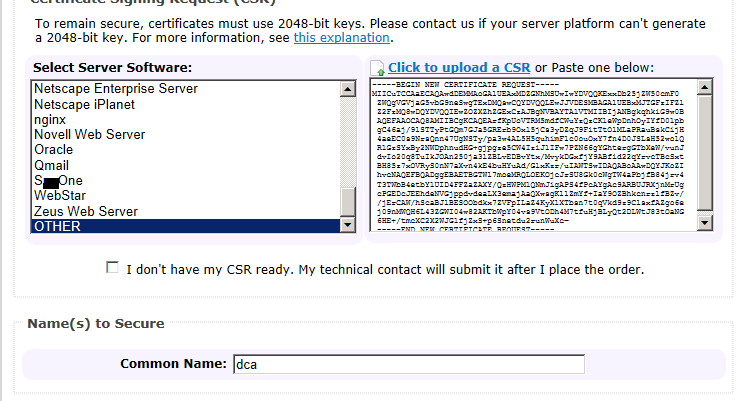

Figura 2.5: Carga del CSR en una CA

**Precaución**: Observe el mensaje de advertencia en la figura 2.5. Mi CSR necesita ser generado con una clave de 2048 bits. La utilidad de DigiCert ofrece eso o 1024 bits. Muchas CA tendrán un requisito de bit-alto. Asegúrese de que su RSE cumple con lo que necesita. Observe también que se trata de un certificado de servidor Web lo que estamos solicitando. Como escribimos anteriormente, es el único tipo de certificado que funcionará.

Eventualmente, la CA emitirá su certificado. La Figura 2.6 muestra el sitio a dónde fuimos para descargarlo. Elegimos descargar todos los certificados. Queríamos asegurarnos de tener una copia del certificado raíz de la CA, en caso de que necesitáramos configurar otra máquina para confiar en esa raíz.

**Sugerencia**: El truco con los certificados digitales es que la máquina que los utiliza y las máquinas a las que se presentarán, deben confiar en la entidad emisora de certificados que emitió el mismo. Es por eso que descarga el certificado raíz de la CA, para que pueda instalarlo en las máquinas que necesitan confiar en dicha CA. En un entorno grande, esto se puede hacer a través de una directiva de grupo, si se quisiera.

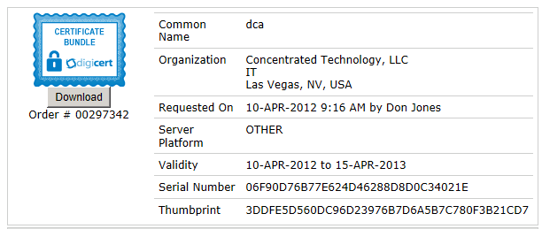

Figura 2.6: Descarga del certificado emitido

Asegúrese de hacer una copia de seguridad de los archivos de certificados. Aunque la mayoría de las CA las publicarían de nuevo de ser necesario, es mucho más fácil tener una copia de seguridad.

#### Instalación del certificado

No intente hacer doble clic en el archivo de certificado para instalarlo. Si lo hace, lo instalará en el almacén de certificados de su cuenta de usuario. Lo necesita en el almacén de certificados de su computadora. Para instalar el certificado, abra una nueva consola de administración de Microsoft (mmc.exe), seleccione Agregar o quitar complementos y agregue el complemento Certificados, como se muestra en la figura 2.7.

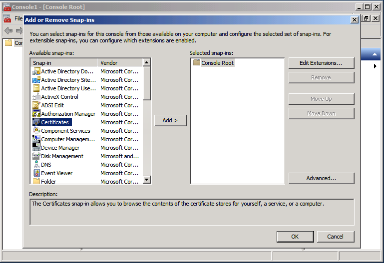

Figura 2.7: Agregar el complemento Certificados a la MMC

Como se muestra en la figura 2.8, establezca el complemento en la cuenta de equipo.

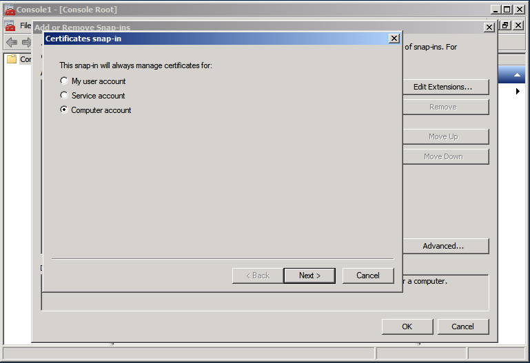

Figura 2.8: Establecer el complemento Certificados en la cuenta de equipo

A continuación, como se muestra en la figura 2.9, establezca el equipo local. Por supuesto, si está instalando un certificado en una computadora remota, establezca esa computadora en su lugar. Esta es una buena forma de instalar un certificado en un ambiente Windows sin GUI como en un Server Core, por ejemplo.

Nota: Quisiéramos poder mostrarle una forma de hacer todo esto desde PowerShell. No pudimos encontrar una que no implicara un montón de pasos más además de complejos. Dado que esto no es algo que tendrá que hacer a menudo o automatizarlo, la GUI es más fácil y debería ser suficiente.

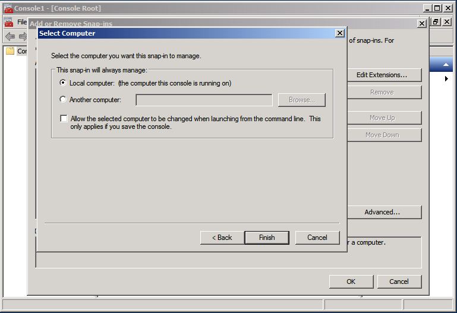

Figura 2.9: Establecer el complemento Certificados en el equipo local

Con el complemento cargado, como se muestra en la figura 2.10, haga clic con el botón derecho en el almacén "Personal" y seleccione "Import".

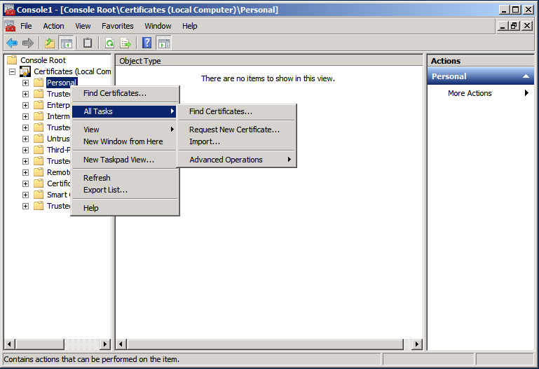

Figura 2.10: Inicio del proceso de importación en el almacén Personal

Como se muestra en la figura 2.11, vaya al archivo de certificado que descargó de su CA. A continuación, haga clic en Next.

**Precaución**: Si ha descargado varios certificados, tal vez los certificados raíz de la CA junto con el certificado, asegúrese de importar el certificado SSL que se le entregó. Si hay alguna confusión, PARE. Vuelva a su CA y descargue sólo su certificado, para que sepa cuál importar. No experimente, necesita realizar bien esto a la primera vez.

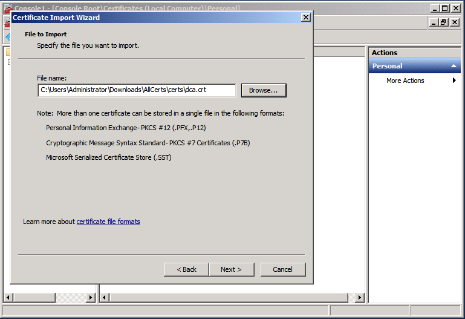

Figura 2.11: Selección del archivo de certificado SSL recién publicado

Como se muestra en la figura 2.12, asegúrese de que el certificado se ubicará en el almacén Personal.

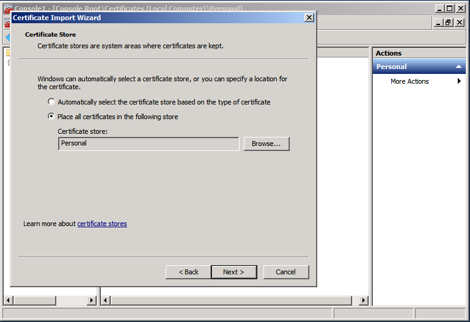

Figura 2.12: Asegúrese de ubicar el certificado en el almacén Personal, que debe estar preseleccionado.

Como se muestra en la figura 2.13, haga doble clic en el certificado para abrirlo. O bien, haga clic con el botón derecho y seleccione Abrir. No seleccione Propiedades - no le proporcionará la información que necesita-.

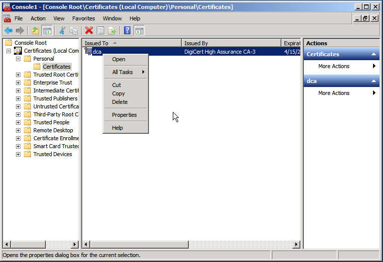

Figura 2.13: Haga doble clic en el certificado o haga clic con el botón derecho del ratón y seleccione Open

Finalmente, como se muestra en la figura 2.14, seleccione la huella digital del certificado. Deberá anotar esto o copiarlo en el Portapapeles. Así WinRM identificará el certificado que desea utilizar.

**Nota**: Es posible listar su certificado en la unidad CERT: de PowerShell, lo que hará que la huella digital sea más fácil de copiar en el Portapapeles. En PowerShell, ejecute Dir CERT:\LocalMachine\My. Asegúrese que selecciona el certificado correcto. Si no se muestra toda la huella digital, ejecute Dir CERT:\LocalMachine\My \| FL \* en su lugar.

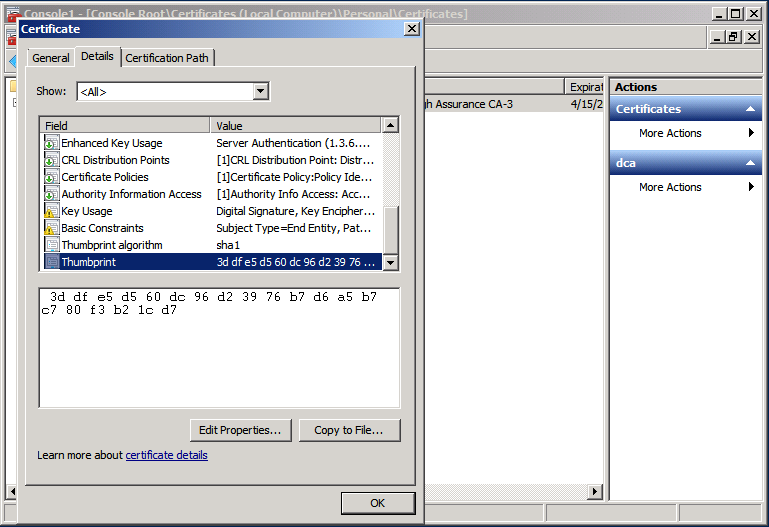

Figura 2.14: Validación de la huella digital del certificado

#### Configuración del listener de HTTPS

Los siguientes pasos se llevarán a cabo en el shell Cmd.exe, no en PowerShell. La sintaxis de la utilidad de línea de comandos requiere un ajuste significativo y escapar algunas cosas en PowerShell, así que es mucho más sencillo de escribir y entender directamente en el shell de Cmd.exe (que es donde la utilidad tiene que ejecutarse de todos modos). Ejecutarlo en PowerShell sólo lanzaría Cmd. Exe tras bambalinas.

Como se muestra en la figura 2.15, ejecute el siguiente comando:

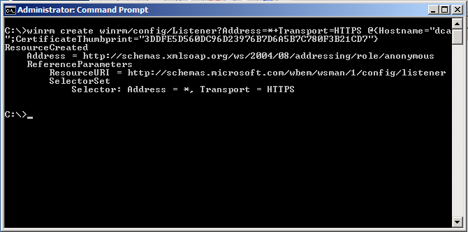

Figura 2.15: Configuración del listener de HTTPS WinRM

```
Winrm create winrm/config/Listener?Address=\*+Transport=HTTPS @{Hostname="xxx";CertificateThumbprint="yyy"}
```

Hay dos o tres piezas de información que necesitará colocar en este comando:

* En lugar de \*, puede poner una dirección IP individual. El uso de \* hará que el oyente \(listener\) escuche todas las direcciones IP locales.
* En lugar de xxx, coloque el nombre de equipo exacto para el que se emitió el certificado. Si eso incluye un nombre de dominio \(como dc01.ad2008r2.loc\), póngalo. Lo que está en el certificado debe ir aquí, de lo contrario tendrá un error de coincidencia CN. Como nuestro certificado fue emitido a "dca", puse "dca"
* En lugar de yyy, coloque la huella digital de certificado exacta que copió anteriormente. Está bien si contiene espacios.

Eso es todo lo que debe hacer para que el oyente (listener) funcione.

**Nota**: Teníamos el Firewall de Windows deshabilitado en este servidor, por lo que no necesitamos crear una excepción. La excepción no se crea automáticamente; por lo tanto, si tiene un firewall habilitado en su computadora, deberá crear manualmente la excepción para el puerto 5986.

También puede ejecutar un comando equivalente de PowerShell para realizar esta tarea:

```
New-WSManInstance winrm/config/Listener -SelectorSet @{Address='\*';
Transport='HTTPS'} -ValueSet @{HostName='xxx';CertificateThumbprint='yyy'}
```

En ese ejemplo, "xxx" y "yyy" se reemplazan como lo hicieron en el ejemplo anterior.

#### Probando el HTTPS Listener

He probado esto desde el equipo C3925954503 independiente, tratando de llegar al controlador de dominio DCA en COMPANY.loc. He configurado C3925954503 en el archivo HOSTS, de modo que podría resolver el nombre de host DCA a la dirección IP correcta sin necesidad del DNS. Estaba seguro de que correría:

```
Ipconfig /flushdns
```

Esto aseguró que el archivo HOSTS se leyó en el caché de nombres DNS. Los resultados se muestran en la figura 2.16. Tenga en cuenta que no puedo acceder a DCA utilizando directamente su dirección IP, porque el certificado SSL no contiene una dirección IP. El certificado SSL se emitió a "dca", por lo que tenemos que ser capaces de acceder a la computadora escribiendo "dca" como el nombre de la computadora. El uso del archivo HOSTS permitirá que Windows resuelva eso a una dirección IP.

**Nota**: Recuerde, hay dos cosas que suceden aquí: Windows debe poder resolver el nombre a una dirección IP, que es lo que hace el archivo HOSTS, con el fin de hacer una conexión física. Pero WinRM necesita autenticación mutua, lo que significa que cualquier cosa que escribimos en el parámetro -ComputerName debe coincidir con lo que está en el certificado SSL. Es por eso que no podemos simplemente proporcionar una dirección IP al comando - habría funcionado para la conexión, pero no la autenticación.

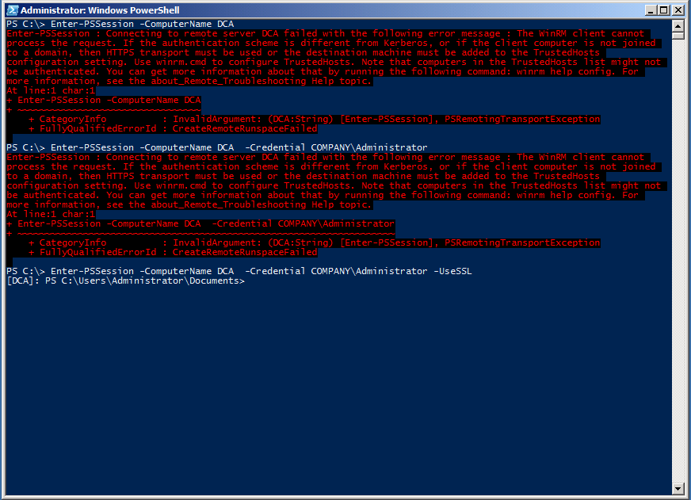

Figura 2.16: Prueba del Listener de HTTPS

Comenzamos con esto:

```
Enter-PSSession -computerName DCA
```

No funcionó, como se esperaba. Entonces intentamos esto:

```
Enter-PSSession -computerName DCA -credential COMPANY\Administrator
```

Proporcionamos una contraseña válida para la cuenta de administrador, pero como se esperaba, el comando no funcionó. Finalmente:

```
Enter-PSSession -computerName DCA -credential COMPANY\Administrator -UseSSL
```

Nuevamente proporcionando una contraseña válida, se mostró el aviso remoto que esperábamos. ¡Funcionó! Esto cumple las dos condiciones que especificamos anteriormente: Estamos utilizando una conexión HTTPS y proporcionamos una credencial. Ambas condiciones son necesarias porque el equipo no está en mi dominio (ya que en este caso el equipo de origen no está ni siquiera en un dominio). Solo para recordar, la figura 2.17 muestra, en verde, la conexión que creamos y usamos.

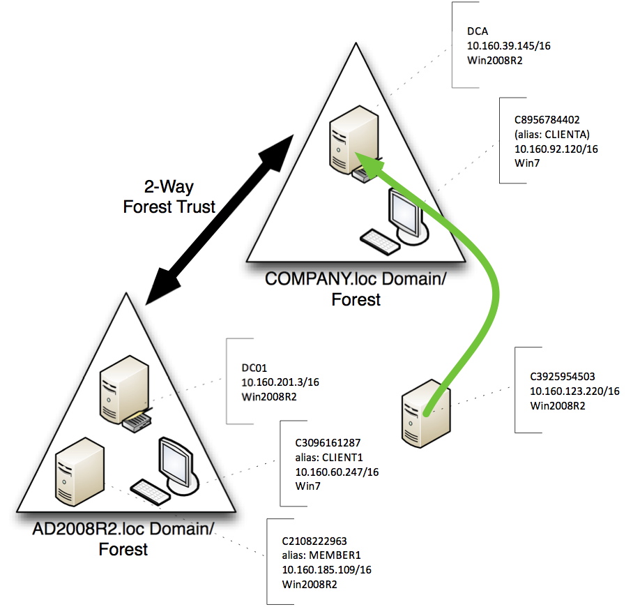

Figura 2.17: La conexión utilizada para la prueba de escucha de HTTPS

#### Modificadores

Hay dos modificadores que puede utilizar en una conexión, ya sea con Invoke-Command, Enter-PSSession o algún otro comando Remoting, que se relacionan con los oyentes \(listeners\) HTTPS. Éstos se crean como parte de un objeto de opción de sesión.

* -SkipCACheck hace que WinRM no se preocupe si el certificado SSL fue emitido por una entidad de confianza o no. Sin embargo, utilizar CAs no confiables en realidad puede ser poco fiable. Una CA “pobre” puede emitir un certificado para una computadora falsa, lo que le lleva a creer que se está conectando a la máquina correcta cuando de hecho se está conectando a una maquina impostora. Esto es riesgoso, así que úselo con precaución.
* -SkipCNCheck hace que WinRM no se preocupe si el certificado SSL en la máquina remota se emitió realmente para esa máquina o no. Una vez más, esta es una gran manera de encontrarse conectado a un impostor. La mitad del punto de SSL es la autenticación mutua, y este parámetro desactiva esa mitad.

El uso de una o ambas de estas opciones seguirán activando el cifrado SSL en la conexión, pero habrá aniquilado el otro propósito esencial de SSL, que es la autenticación mutua por medio de una autoridad intermedia de confianza.

Para crear y utilizar un objeto de sesión que incluye ambos parámetros:

```
$option = New-PSSessionOption -SkipCACheck -SkipCNCheck
Enter-PSSession -computerName DCA -sessionOption $option
        -credential COMPANY\Administrator -useSSL
```

**Precaución**: Sí, esta es una manera fácil de hacer que los mensajes de error molestos desaparezcan. Pero esos errores están intentando advertirle de un problema potencial y le defienden de riesgos potenciales de la seguridad que son muy reales, y que están muy en uso por los atacantes modernos.

## Autenticación de certificados

Una vez que haya establecido un oyente (listener) de HTTPS, tendrá la opción de autenticarse con Certificados. Esto le permite conectarse a equipos remotos, incluso aquellos en un dominio o grupo de trabajo no confiable, sin requerir el ingreso de usuario-clave, lo que puede ser útil cuando se programa una tarea para ejecutar un script de PowerShell, por ejemplo.

En la autenticación de certificados, el cliente tiene un certificado con una clave privada y el equipo remoto asigna la clave pública de ese certificado a una cuenta de Windows local. WinRM requiere un certificado que tenga "Client Authentication \(1.3.6.1.5.5.7.3.2\)" que aparece en el atributo Enhanced Key Usage, y que tiene un nombre principal de usuario listado en el atributo Subject Alternative Name. Si utiliza la  Autoridad de Certificación de Microsoft Enterprise, la plantilla de certificado "Usuario" cumple estos requisitos.

#### Obtención de un certificado de autenticación de cliente

Estas instrucciones asumen que tiene una CA de Microsoft Enterprise. Si está utilizando un método diferente de inscripción de certificados, siga las instrucciones proporcionadas por su proveedor o el administrador de CA.

En el equipo cliente, realice los siguientes pasos:

* Ejecute certmgr.msc para abrir la consola " Certificates - Current User".
* Haga clic derecho en el nodo "Personal" y seleccione All Tasks -> Request New Certificate
* En el cuadro de diálogo Certificate Enrollment, haga clic en Next. Seleccione "Active Directory Enrollment Policy " y haga clic en Next de nuevo. Seleccione la plantilla User y haga clic en Enroll

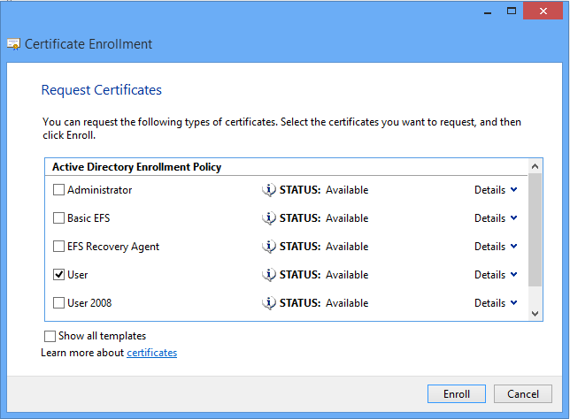

Figura 2.18: Solicitud de un certificado de usuario.

Una vez finalizado el proceso de inscripción (enrolamiento) y regrese de nuevo a la consola de certificados, debería ver el nuevo certificado en la carpeta Personal\Certificates:

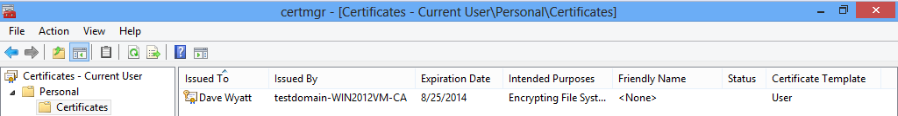

Figura 2.19: El certificado de autenticación de cliente instalado del usuario.

Antes de cerrar la consola de Certificados, haga clic con el botón derecho en el nuevo certificado y seleccione All Tasks -> Export. En las pantallas siguientes, elija " do not export the private key" y guarde el certificado en un archivo en disco. Copie el certificado exportado al equipo remoto, para utilizarlo en los pasos siguientes.

#### Configuración del equipo remoto para permitir la autenticación de certificados

En el equipo remoto, ejecute la consola de PowerShell como Administrador e introduzca el siguiente comando para habilitar la autenticación del certificado:

```
Set-Item -Path WSMan:\localhost\Service\Auth\Certificate -Value $true
```

#### Importar el certificado del cliente en el equipo remoto

El certificado del cliente debe agregarse al almacén de certificados de " Trusted People" del equipo. Para ello, realice los pasos siguientes para abrir la consola "Certificados \(equipo local\)":

* Ejecutar "mmc".
* En el menú Archivo, elija " Add/Remove Snap-in".
* Resalte " Certificates" y haga clic en el botón Add.
* Seleccione la opción " Computer Account" y haga clic en Next.
* Seleccione "Local Computer", haga clic en Finish y a continuación, haga clic en OK

**Nota:** Este es el mismo proceso que siguió en la sección "Instalación del certificado" en Configuración y escucha de HTTPS. Consulte las figuras 2.7, 2.8 y 2.9 si es necesario.

En la consola de Certificados \(Local Computer\), haga clic con el botón secundario “Trusted People" y seleccione All Tasks -> Import.

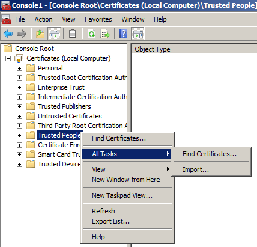

Figura 2.20: Inicio del proceso de importación de certificados.

Haga clic en Next y busque la ubicación donde copió el archivo de certificado del usuario.

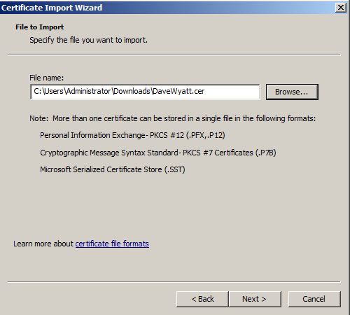

Figura 2.21: Selección del certificado del usuario.

Asegúrese de que el certificado se coloca en el almacén de “Trusted People”:

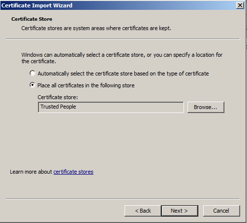

Figura 2.22: Colocación del certificado en el almacén de “Trusted People”.

#### Creación de una asignación de certificados de cliente en el equipo remoto

Abra una consola de PowerShell como Administrador en el equipo remoto. Para el paso siguiente, necesitará la huella digital de certificado de la CA que emitió el certificado del cliente. Debería poder encontrarlo utilizando uno de estos comandos \(dependiendo de si el certificado de la entidad emisora de certificados se encuentra en las " Trusted Root Certification Authorities " o en la "Intermediate Certification Authorities"\):

```
Get-ChildItem -Path cert:\LocalMachine\Root  
Get-ChildItem -Path cert:\LocalMachine\CA
```

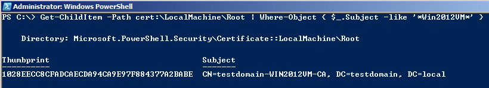

Figura 2.23: Obtención de la huella digital del certificado de la CA.

Una vez que tenga la huella digital, emita el siguiente comando para crear la asignación de certificados:

```
New-Item -Path WSMan:\localhost\ClientCertificate -Credential (Get-Credential) -Subject <userPrincipalName> -URI \* -Issuer <CA Thumbprint> -Force
```

Cuando se le pidan credenciales, ingrese el nombre de usuario y la contraseña de una cuenta local con derechos de administrador.

**Nota:** No es posible especificar las credenciales de una cuenta de dominio para la asignación de certificados, incluso si el equipo remoto es un miembro de un dominio. Debe utilizar una cuenta local y la cuenta debe ser miembro del grupo Administradores.

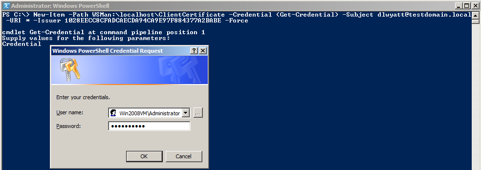

Figura 2.24: Configuración de la asignación de certificados de cliente.

#### Conexión al equipo remoto mediante la autenticación de certificados

Ahora, debe estar listo para autenticarse en el equipo remoto utilizando su certificado. En este paso, necesitará la huella digital del certificado de autenticación de cliente. Para obtenerlo, puede ejecutar el siguiente comando en el equipo cliente:

```
Get-ChildItem -Path Cert:\CurrentUser\My
```

Una vez que tenga esta huella digital, puede autenticarse en el equipo remoto mediante los Cmdlets Invoke-Command o New-PSSession con el parámetro -CertificateThumbprint, como se muestra en la figura 2.25.

**Nota:** El Cmdlet Enter-PSSession no parece funcionar con el parámetro -CertificateThumbprint. Si desea introducir una sesión de acceso remoto interactiva con autenticación de certificado, utilice primero New-PSSession y, a continuación, Enter-PSSession.

**Nota:** El modificador -UseSSL está implícito cuando se utiliza -CertificateThumbprint en cualquiera de estos comandos. Incluso si no escribe -UseSSL, seguirá conectándose al equipo remoto a través de HTTPS (puerto 5986, de forma predeterminada, en Windows 7/2008 R2 o posterior). La Figura 2.26 muestra esto.

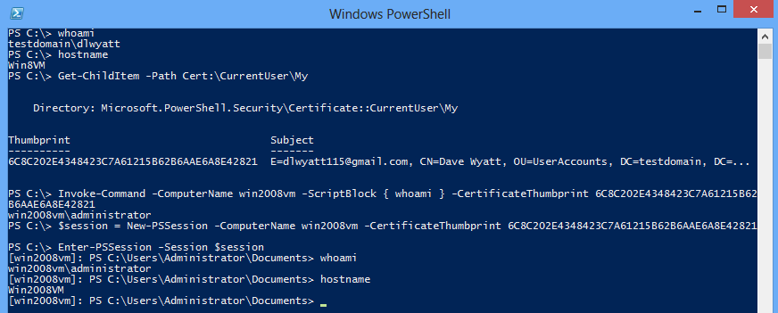

Figura 2.25: Uso de un certificado para autenticarse con PowerShell Remoting.

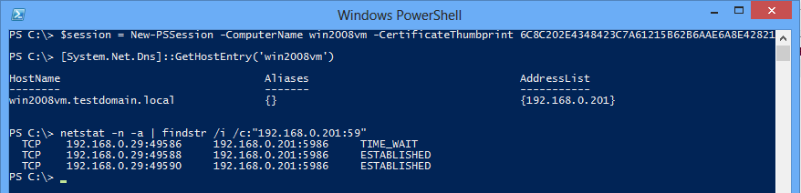

Figura 2.26: Demostración de que la conexión está sobre el puerto SSL 5986, incluso sin el modificador -UseSSL.

## Modificación de la lista TrustedHosts

Como mencioné anteriormente, el uso de SSL es sólo una opción para conectarse a un equipo para el que no es posible la autenticación mutua. La otra opción es desactivar selectivamente la necesidad de autenticación mutua proporcionando a su equipo una lista de "hosts de confianza". En otras palabras, le está diciendo a su computadora, "Si intento acceder a SERVER1 \[por ejemplo\], no se molesten con la autenticación mutua. Estoy seguro que SERVER1 no puede ser falsificado o suplantado, por lo que estoy tomando esa responsabilidad."

La figura 2.27 ilustra la conexión que vamos a intentar.

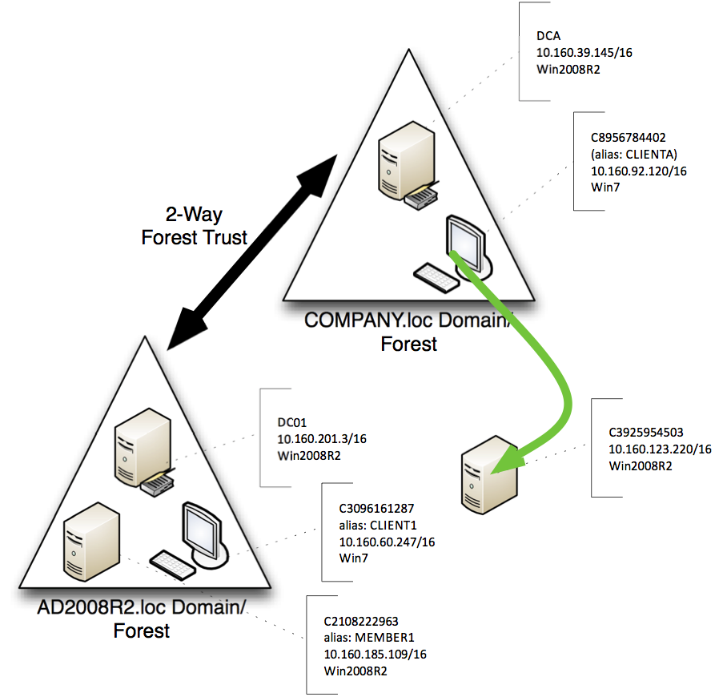

Figura 2.27: Prueba de conexión a un TrustedHosts

A partir de un cliente, con una configuración Remoting completamente predeterminada, intentaremos conectarnos a C3925954503, que también tiene una configuración de Remoting por defecto. La figura 2.28 muestra el resultado. Tenga en cuenta que estoy conectando a través de la dirección IP, en lugar de al hostname. Nuestro cliente no tiene ninguna manera de resolver el nombre de la computadora a una dirección IP, y para esta prueba preferimos no modificar mi archivo local HOSTS.

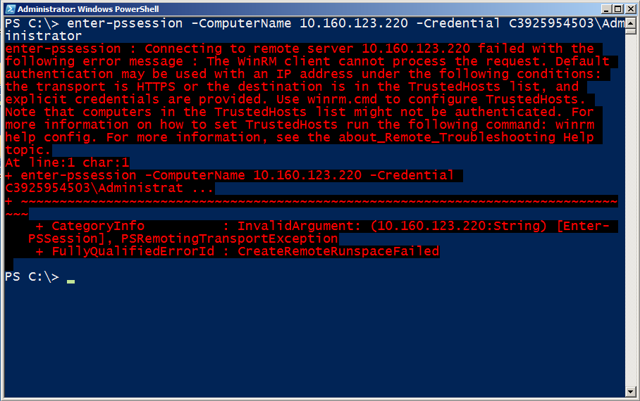

Figura 2.28: Intentando conectarse al equipo remoto

Esto es lo que esperábamos: El mensaje de error es claro. No podemos usar una dirección IP \(o un nombre de host para un equipo que no sea de dominio, aunque el error no lo diga\) a menos que utilicemos HTTPS y una credencial o que agregue la computadora a mi lista de TrustedHosts y use una credencial. Elegiremos esta última opción. La figura 2.29 muestra el comando que debemos ejecutar. Si hubiéramos querido conectarnos a través del nombre de la computadora \(C3925954503\) en lugar de su dirección IP, habríamos añadido ese nombre de equipo a la lista de TrustedHosts \(sería nuestra responsabilidad asegurar que mi computadora pudiera de alguna manera resolver ese nombre de equipo a una dirección IP para realizar la conexión física\).


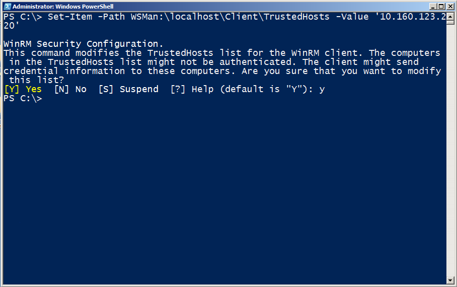

Figura 2.29: Agregar la máquina remota a nuestra lista TrustedHosts

Este es otro caso en el que muchos blogs aconsejarán simplemente poner "\*" en la lista de TrustedHosts. ¿De verdad? ¿No hay ninguna posibilidad de que cualquier computadora, nunca, en ningún lugar, pudiera ser suplantada o falsificada? Preferimos agregar un conjunto limitado y controlado de nombres de host o direcciones IP. Utilice una lista separada por comas. Está bien usar comodines junto con otros caracteres \(como un nombre de dominio, como * .COMPANY.loc\), para permitir un rango amplio pero no ilimitado de computadoras. La figura 2.30 muestra una conexión correcta.

**Sugerencia**: Utilice el parámetro -Concatenate de Set-Item para agregar su nuevo valor a los existentes, en lugar de sobrescribirlos.

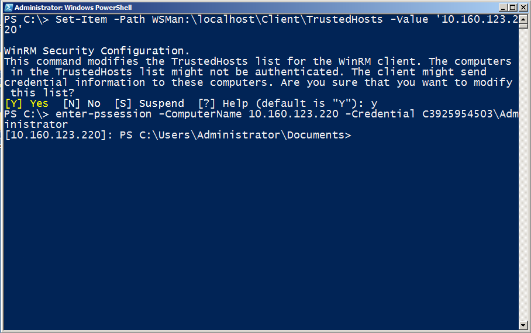

Figura 2.30: Conexión a la computadora remota

Administrar la lista de TrustedHosts es probablemente la forma más fácil de conectarse a un equipo que no puede ofrecer autenticación mutua, siempre y cuando esté absolutamente seguro de que la suplantación no es una posibilidad. En una intranet, por ejemplo, donde ya tiene buenas prácticas de seguridad, la suplantación puede ser una posibilidad remota y puede agregar un rango de direcciones IP o un rango de nombres de host utilizando comodines.

## Conexión a través de dominios

La Figura 2.31 ilustra la siguiente conexión que trataremos de hacer, que se encuentra entre dos equipos en dominios diferentes de confianza.

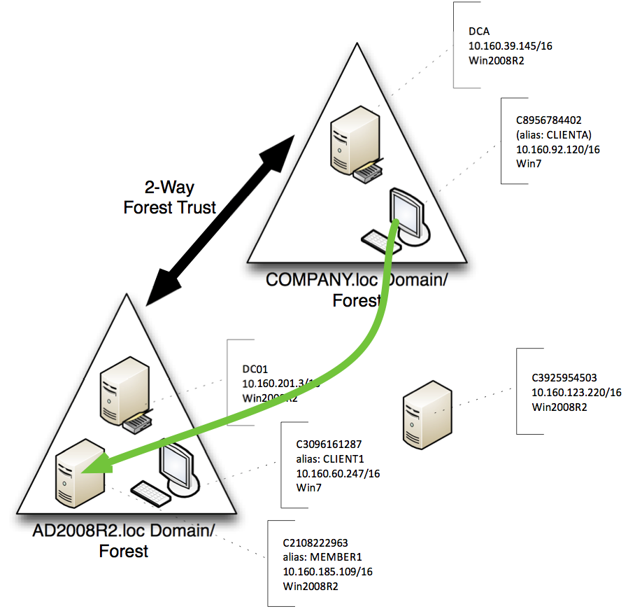

Figura 2.31: Conexión de prueba entre dominios

Nuestra primera prueba está en la figura 2.32. Tenga en cuenta que estamos creando una credencial reutilizable en la variable $cred, para que no tengamos que volver a teclear la contraseña mientras lo intentamos. Sin embargo, los resultados de la prueba de Remoting todavía no tienen éxito.

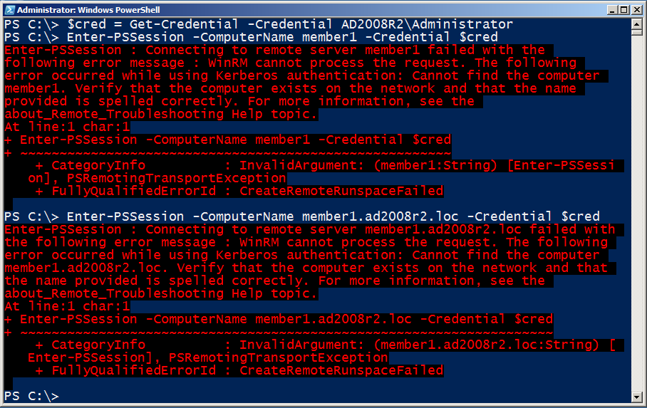

Figura 2.32: Intentar conectarse al equipo remoto

¿El problema? Estamos usando un alias CNAME \(MEMBER1\), no el nombre de host real de la computadora \(C2108222963\). Aunque WinRM puede utilizar un CNAME para resolver un nombre a una dirección IP para la conexión física, no puede utilizar el alias CNAME para buscar el equipo en AD, ya que AD no utiliza el registro CNAME \(incluso en una Zona AD-DNS integrada\). Como se muestra en la figura 2.33, la solución es usar el nombre de host real de la computadora.

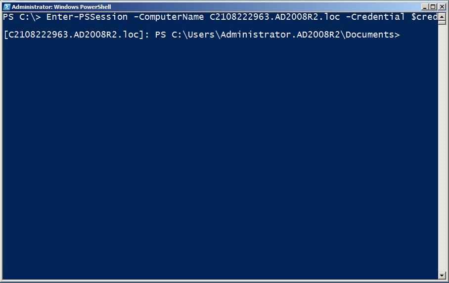

Figura 2.33: Conectar correctamente a través de dominios

¿Qué pasa si _necesita_ usar una dirección IP o alias CNAME para conectarse? Tendrá que volver a la lista de TrustedHosts o a un detector de HTTPS, exactamente como si se estuviera conectando a un equipo que no pertenece al dominio. Esencialmente, si no puede utilizar el nombre de host real de la computadora, tal como aparece en AD, entonces no puede confiar en el dominio para acelerar el proceso de autenticación.

## Administradores de otros dominios

Hay una peculiaridad en Windows que tiende a obviar el token de la cuenta de administrador para las cuentas de administrador procedentes de otros dominios, lo que significa que terminan ejecutándose bajo privilegios de usuario estándar, lo que a menudo no es suficiente. En el dominio de destino, se puede cambiar ese comportamiento.

Para ello, ejecute esto en el equipo de destino \(escriba todo esto en una línea y pulse Enter\):

```
New-ItemProperty -Name LocalAccountTokenFilterPolicy
-Path HKLM:\SOFTWARE\Microsoft\Windows\CurrentVersion\
Policies\System -PropertyType Dword -Value 1
```

Eso debería solucionar el problema. Tenga en cuenta que esto desactiva el Control de cuentas de usuario \(UAC\) en la máquina donde lo ejecutó, así que asegúrese de lo que está haciendo antes de hacerlo.

## El segundo salto

Una limitación predeterminada con Remoting es a menudo referida como el segundo salto. La Figura 2.25 ilustra el problema básico: Puede realizar una conexión Remoting de un host a otro \(la línea verde\), pero pasar de ese segundo host a un tercero \(la línea roja\) simplemente se rechaza. Este "segundo salto" no funciona porque, de forma predeterminada, Remoting no puede delegar su credencial por segunda vez. Esto es incluso un problema si realiza el primer salto y posteriormente intenta acceder a cualquier recurso de red que requiera autenticación. Por ejemplo, si accede a otro equipo y, a continuación intenta tener acceso a algún archivo compartido pero necesita autenticación, la operación falla.

### La solución CredSSP

Los siguientes cambios de configuración son necesarios para habilitar el segundo salto:

**Nota:** Esto sólo funciona en Windows Vista, Windows Server 2008 y versiones posteriores de Windows. No funcionará en Windows XP o Windows Server 2003 o versiones anteriores.

* CredSSP debe estar habilitado en su computadora de origen y el servidor intermedio al que se conecta. En PowerShell, en el equipo de origen, ejecute:

```
Set-Item WSMAN:\localhost\client\auth\credssp -value $true
```

* En su \(s\) servidor \(es\) intermedio \(s\), realiza un cambio similar al anterior, pero en una sección diferente de la configuración:

```
Set-Item WSMAN:\localhost\service\auth\credssp -value $true
```

* Su política de dominio debe permitir la delegación de nuevas credenciales. En un objeto de directiva de grupo \(GPO\), se encuentra en Configuración del equipo> Políticas> Plantillas administrativas> Sistema> Delegación de credenciales> Permitir delegación de nuevas credenciales. Debe proporcionar los nombres de las máquinas a las que se pueden delegar las credenciales o especificar un comodín como "\*.ad2008r2.loc" para permitir un dominio completo. Asegúrese de dar tiempo para que el GPO actualizado se aplique o ejecute Gpupdate en el equipo de origen \(o reinícielo\).


**Nota:** Una vez más, el nombre que usted proporciona aquí es importante. Lo que realmente va a escribir para el parámetro -ComputerName es lo que debe aparecer aquí. Esto hace que sea realmente difícil delegar credenciales a, digamos, direcciones IP, sin agregar simplemente "\*" como delegado permitido. La adición de "\*", por supuesto, significa que puede delegar en CUALQUIER computadora, lo que es potencialmente peligroso, ya que facilitaría a un atacante suplantar una máquina y apoderarse de su cuenta super-privilegiada de administrador de dominio!

* Al ejecutar un comando Remoting, debe especificar el parámetro "-Authentication CredSSP". También debe utilizar el parámetro -Credential y proporcionar un valor DOMINIO\\Usuario (se le pedirá la contraseña) - incluso si es el mismo nombre de usuario que utilizó para abrir PowerShell al inicio.

Después de configurar lo anterior, pudimos utilizar Enter-PSSession para pasar de nuestro controlador de dominio a mi servidor miembro y, a continuación, utilizar Invoke-Command para ejecutar un comando en un equipo cliente: la conexión ilustrada en la figura 2.34.

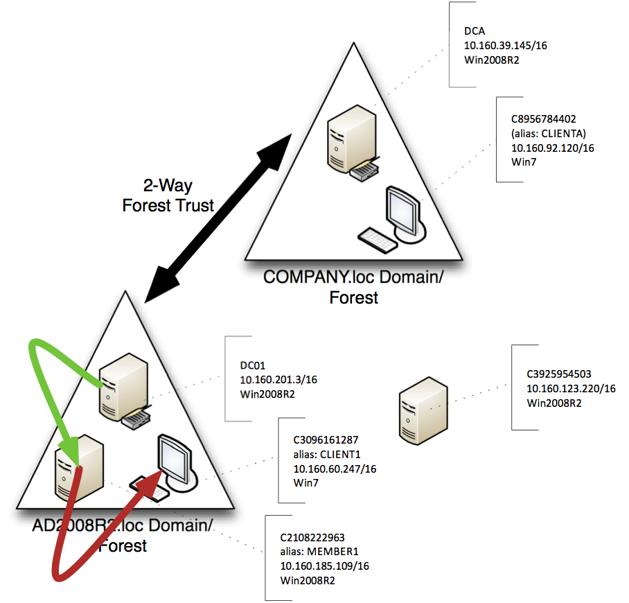

Figura 2.34: Las conexiones para la prueba del segundo salto

¿Le parece tedioso y tedioso hacer todos esos cambios? Hay un camino más rápido. En el equipo de origen, ejecute esto:

```
Enable-WSManCredSSP -Role Client -Delegate name
```

Donde "nombre" es el nombre de los equipos que planea remitir al siguiente. Esto puede ser un comodín, como \*, o un comodín parcial, como \*.AD2008R2.loc. A continuación, en el equipo intermedio \(aquél al que delegará sus credenciales\), ejecute lo siguiente:

```
Enable-WSManCredSSP -Role Server
```

Entre ellos, estos dos comandos logran casi todos los puntos de configuración que enumeramos anteriormente. La única excepción es que modificarán su política local para permitir una nueva delegación de credenciales, en lugar de modificar la directiva de dominio a través de un GPO. Puede optar por modificar la directiva de dominio usted mismo, utilizando la GPMC, para que esa configuración particular sea más universal.

### La solución Kerberos

CredSSP no se considera el protocolo más seguro del mundo \(vea https://msdn.microsoft.com/en-us/library/cc226796.aspx\). Las credenciales se transmiten en texto claro, lo cual es un problema. Afortunadamente, dentro de un dominio, hay otra forma de habilitar el multi-salto Remoting, utilizando el protocolo nativo Kerberos, que no transmite credenciales. Específicamente, se llama delegación de restricciones Kerberos basada en recursos, Ashley McGlone \(@goateePFE\) [escribió sobre ello](https://blogs.technet.microsoft.com/ashleymcglone/2016/08/30/powershell-remoting-kerberos-double-hop-solved-securely/). 

Esta técnica básica funciona desde Windows Server 2003, por lo que debería cubrir cualquier situación que necesite. La idea aquí es que se puede permitir a una máquina delegar credenciales específicas para servicios en otra máquina. Windows Server 2012 simplificó el diseño de esta técnica, anteriormente indocumentada y compleja, por lo que nos centraremos en eso. Por lo tanto, cada máquina involucrada necesita tener Windows Server 2012 o posterior, incluyendo al menos un controlador de dominio Win2012 en el dominio. También necesitará un equipo Windows de última generación con el RSAT instalado \(he usado Windows 10\). Sabrá que tiene la versión de ejecución si puede ejecutar esto:

```
Import-Module ActiveDirectory
Get-Command -ParameterName PrincipalsAllowedToDelegateToAccount
```

Y obtener algunos resultados de vuelta. Si no obtiene nada, tienes una versión anterior del RSAT - necesitara una más nueva, lo que probablemente requerirá una versión más reciente de Windows en su cliente. Por lo tanto, supongamos que estamos en ClientA, queremos conectarnos a ServerB y que delegue una credencial a través de un segundo salto a ServerC.

```
$ClientA = $env:COMPUTERNAME
$ServerB = Get-ADComputer -Identity ServerB
$ServerC = Get-ADComputer -Identity ServerC

Set-ADComputer -Identity $ServerC -PrincipalsAllowedToDelegateToAccount $ServerB
```

Esto permite que ServerC acepte una credencial delegada de ServerB. Si está prestando atención, esto significa que _el equipo al final del segundo salto_ es lo que se necesita modificar, para que pueda recibir una credencial del intermediario. Además, si ya ha intentado un segundo salto antes de configurar esto, tendrá que esperar alrededor de 15 minutos para que la "memoria caché incorrecta" de Active Directory expire y permita que todo funcione correctamente. También podría reiniciar ServerB, si está en un laboratorio o algo así.

El -PrincipalsAllowedToDelegateToAccount también puede ser una matriz, como en @\($ServerB, $ServerZ, $ ServerX\), etc., permitiendo que varios orígenes deleguen una credencial en la cuenta de equipo que está actualizando. Puede hacer este trabajo a través de límites de confianza, también - vea el artículo original de Ashley para aplicar esta técnica.
