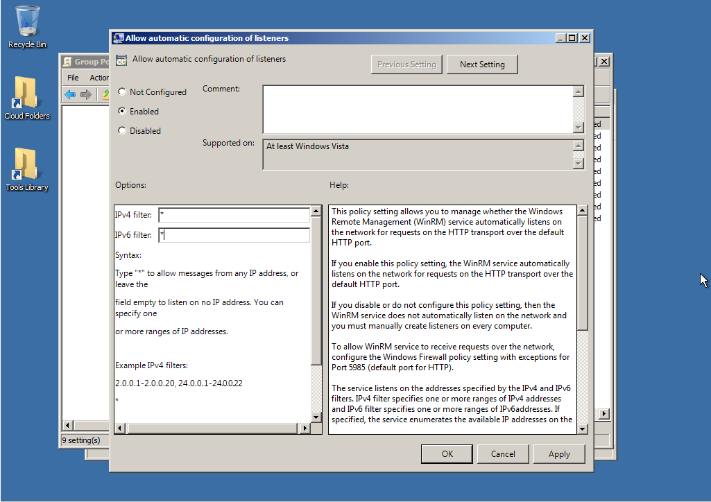
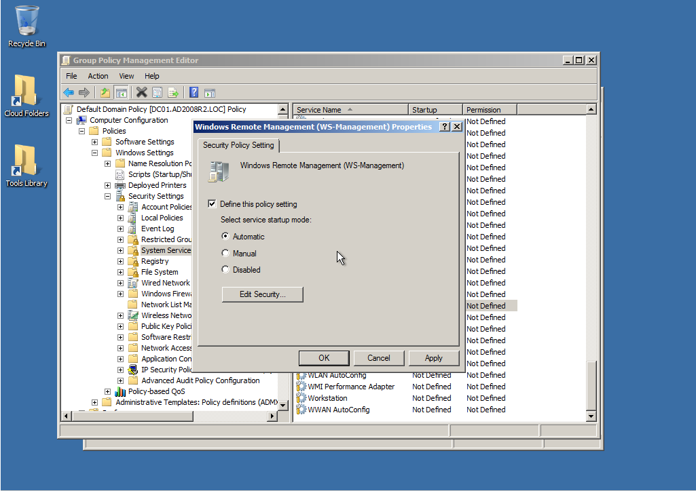
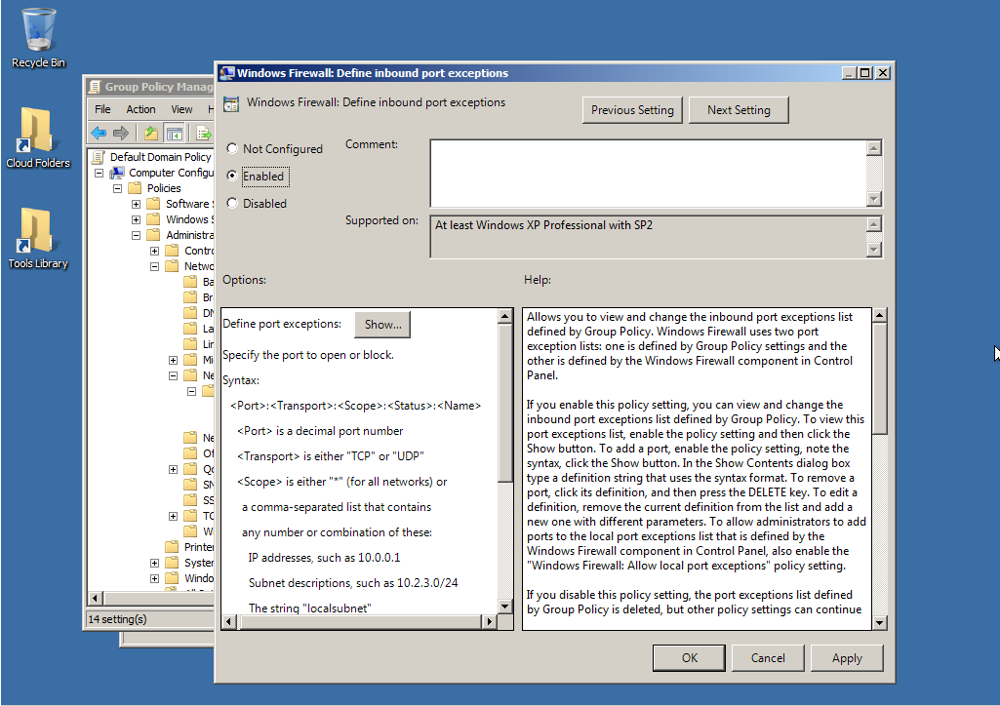
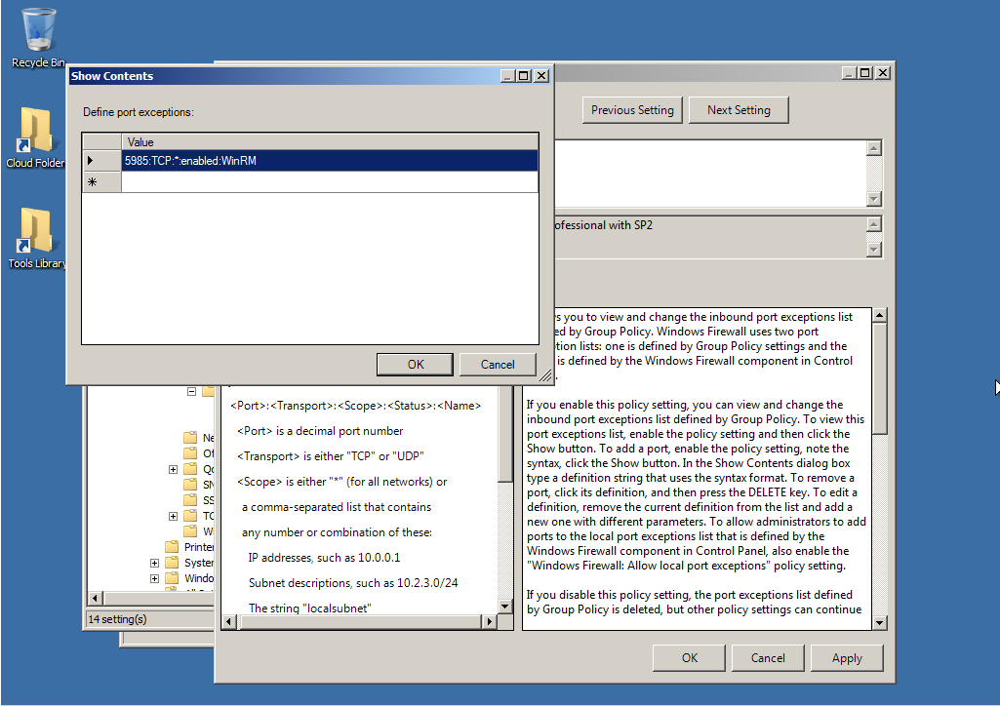
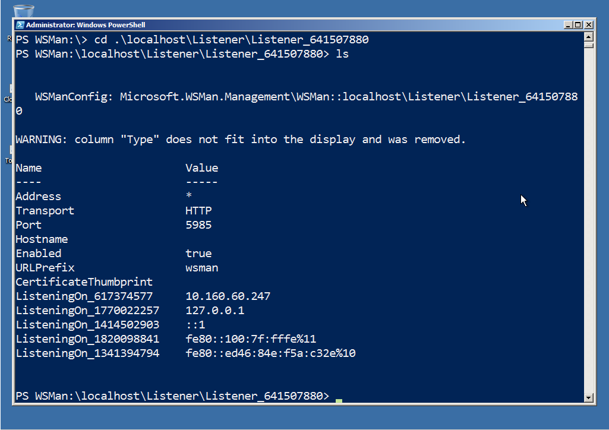
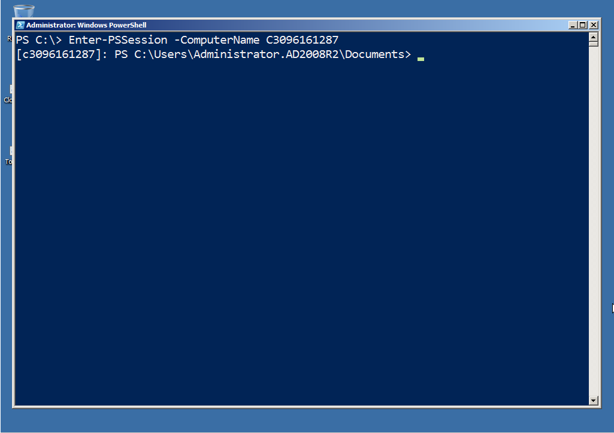

# Configuración de Remoting mediante GPO

La documentación de _About_remote_troubleshooting_ de PowerShell proporciona un conjunto de pasos para configurar la funcionalidad de Remoting básica a través de objetos de directiva de grupo (GPO). Ejecutando Enable-PSRemoting también revela algunos detalles útiles, como las cuatro principales configuraciones necesarias. En esta sección, cubriremos estos pasos de configuración principales.

**Nota:** Nada de esto es necesario en Windows Server 2012 y versiones posteriores del sistema operativo de servidor. Remoting está habilitado de forma predeterminada y no debería encontrar problemas, ya que muchas de las herramientas de administración nativas (incluidas las consolas GUI, como el Administrador de servidores) dependen de Remoting.

## Advertencias de GPO

Una cosa a tener en cuenta es que a través de una GPO sólo se pueden establecer cambios de configuración. No se puede cambiar el estado del ordenador. En otras palabras, mientras una GPO puede configurar el modo de inicio de un servicio como "Automático", no puede iniciar el servicio. Por lo tanto, en muchos casos, los cambios que realice a través de GPO (con respecto a Remoting) no surtirán efecto hasta la próxima vez que se reinicien los equipos afectados, ya que en la mayoría de los casos la computadora sólo mira la configuración durante el arranque. No pierda esto de vista.

Además, todo en esta sección supone que PowerShell ya está instalado en los equipos de destino, algo que también se puede lograr con una GPO u otro mecanismo de implementación de software, por lo tanto no vamos a cubrir eso aquí. Tenga en cuenta que la mayor parte de esta sección debería aplicarse a PowerShell v2 o v3. En esto ejemplos, vamos a utilizar v2 en un equipo cliente con Windows 7 perteneciente a un dominio de Windows Server 2008 R2.

**Nota:** Algunas de las configuraciones de GPO que estaremos revisando estarán disponibles en Windows 2008 y Windows 2008 R2, por lo que debería  ser capaz de instalar las plantillas administrativas necesarias en cualquier controlador de dominio. El Kit de herramientas de administración remota (RSAT) de Windows 7 (y versiones posteriores) contiene las plantillas necesarias.

No sabemos con certeza si los pasos de configuración de GPO deben realizarse en el orden en que los presentamos. En la mayoría de los casos, esperamos que los haga todos a la vez en un solo GPO, por lo que no debería importar. Lo llevaremos paso a paso en este orden para que podamos comprobar los resultados individuales a lo largo del camino.

## Permitir la configuración automática de los escuchas (Listeners) de WinRM

Como se explicó anteriormente en esta guía, el servicio WinRM configura uno o más oyentes (listeners) para aceptar el tráfico entrante. Ejecutar Enable-PSRemoting, por ejemplo, configura un detector de HTTP y ya hemos cubierto cómo configurar un detector de HTTPS además de, o en lugar de, uno predeterminado.

Encontrará esta configuración en: Computer Configuration\\Administrative Templates\\Windows Components\\Windows Remote Management (WinRM)\\WinRM Service. Habilite la directiva y especifique los filtros IPv4 e IPv6, que determinan en qué rangos de direcciones IP se configurará. Puede utilizar el comodín \* para designar todas las direcciones IP, que es lo que hemos hecho en la Figura 7.1.



Figura 7.1: Habilitación de la configuración automática de los oyentes de WinRM

## Configuración del servicio WinRM para que se inicie automáticamente

Este servicio está configurado para iniciarse automáticamente en los sistemas operativos de servidor más recientes (Windows Server 2003 y posteriores), pero no en los clientes, así que este paso sólo será necesario para los equipos cliente. Una vez más, esto no iniciará el servicio, pero la próxima vez que se reinicie el equipo, el servicio se iniciará automáticamente.

Microsoft sugiere realizar esta tarea ejecutando un comando de PowerShell, que no requiere que se habilite Remoting para funcionar:

````
Set-Service WinRM -computername $servers -startup Automatic
````

Puede llenar $servers de la forma que desee, siempre que contenga cadenas que sean nombres de equipos y siempre y cuando tenga credenciales de administrador en esos equipos. Por ejemplo, para capturar cada equipo de su dominio, ejecutaría lo siguiente (esto supone PowerShell v2 o v3, en un equipo con Windows 7 con el RSAT instalado):

````
Import-Module ActiveDirectory
$servers = Get-ADComputer -filter \* | Select -expand name
````

Es probable que desee limitar el número de ordenadores especificando un - Filter distinto de "\*" o especificando -SearchBase y limitando la búsqueda a una UO específica. Lea la ayuda de Get-ADComputer para obtener más información sobre esos parámetros.

Tenga en cuenta que Set-Service devolverá un error si no puede conectarse a una computadora o aquellas para las que el cambio no se pudo establecer y luego continuara con la siguiente computadora en la lista.

También puede configurar esto con una GPO. En Computer Configuration\Windows Settings\Security Settings\System Services, busque "Windows Remote Management ". Haga clic con el botón derecho y establezca un modo de inicio automático. Eso es lo que hicimos en la figura 7.2.



Figura 7.2: Configuración del modo de inicio del servicio WinRM

## Creación de una excepción de Firewall de Windows

Este paso será necesario en todos los equipos en los que esté habilitado el Firewall de Windows. Estamos asumiendo que sólo desea que Remoting esté habilitado en su perfil de firewall de dominio, de modo que eso es todo lo que haremos en nuestro ejemplo. Por supuesto, usted puede gestionar cualquier otra excepción que desee en los perfiles que sean apropiados para su entorno.

Encontrará una configuración Computer Configuration\Administrative Templates\Network\Network Connections\Windows Firewall\Domain Profile. Tenga en cuenta que la directiva " Windows Firewall: Allow Local Port Exceptions " simplemente permite a los administradores locales configurar las excepciones de Firewall mediante el Panel de control. En realidad no crea excepciones.

Entonces, ubicamos la política "Define inbound port exceptions " y lo habilitamos, como se muestra en la figura 7.3



Figura 7.3: Habilitación de excepciones de Firewall

A continuación, hicimos clic en " Show ", y agregamos " 5985:TCP:*:enabled:WinRM " como una nueva excepción, como se muestra en la figura 7.4.



Figura 7.4: Creación de la excepción de Firewall

## ¡Darle una oportunidad!

Después de aplicar los cambios de GPO anteriores, reiniciamos nuestro equipo cliente. Cuando se inicia el servicio WinRM, este comprueba si tiene oyentes configurados. Cuando descubra que no lo hace, debería intentar configurar automáticamente uno, lo que ahora le hemos permitido hacer mediante GPO. La excepción Firewall debe permitir que el tráfico entrante llegue al oyente.

Como se muestra en la figura 7.5, parece que funciona. ¡Hemos encontrado al oyente recién creado!



Figura 7.5: Comprobación del escuchador WinRM recién creado

Por supuesto, no se puede saber si algo funciona, hasta que no se pone a prueba. Así que intentamos conectar desde  otra computadora y, como se muestra en la figura 7.6, pudimos iniciar una sesión de Remoting interactiva en nuestro equipo cliente original. No hemos configurado nada excepto a través de GPO, y todo está funcionando.



Figura 7-6: Iniciando una sesión de Remoting 1-a-1 con el equipo cliente configurado mediante GPO

## Lo que no se puede hacer con una GPO

No puede utilizar una GPO para iniciar el servicio WinRM, como ya lo hemos indicado. Tampoco se pueden crear escuchas (listeners) personalizadas a través de GPO, ni puede crear puntos finales de PowerShell personalizados (configuraciones de sesión). Sin embargo, una vez que se habilita el Remoting básico mediante GPO, puede utilizar el Cmdlet Invoke-Command de PowerShell para realizar de forma remota esas tareas. Incluso puede usar Invoke-Command para deshabilitar remotamente el oyente HTTP predeterminado, si así lo desea.

Además, tenga en cuenta que el WSMAN PSProvider de PowerShell puede asignar la configuración WinRM de los equipos remotos a la unidad WSMAN local. Es por eso que, por defecto, la "carpeta" de nivel superior en esa unidad es "localhost"; De modo que hay un lugar para agregar otros ordenadores, si lo desea. Eso ofrece otra forma de configurar oyentes (listeners) y otros ajustes relacionados con Remoting.

La verdadera clave es utilizar GPO para habilitar Remoting en su forma básica. A partir de ahí, puede utilizar Remoting en sí para modificar, reconfigurar y/o establecer la configuración
