# Diagnóstico y solución de problemas
La solución de problemas y diagnóstico de Remoting puede ser una de las tareas más difíciles que un administrador tenga que tratar. Cuando funciona Remoting, funciona. Cuando no lo hace, a menudo es difícil saber por qué. Afortunadamente, PowerShell v3 y su implementación adjunta de Remoting tienen mensajes de errores mucho más claros y descriptivos que las anteriores versiones. Sin embargo, incluso v2 incluye un módulo indocumentado y poco valorado llamado PSDiagnostics, que está diseñado específicamente para facilitar la solución de problemas Remoting. Esencialmente, el módulo le permite activar la información detallada del registro de seguimiento antes de intentar iniciar una conexión remota. A continuación, puede utilizar esa información de registro detallada para obtener una mejor idea de dónde está fallando Remoting.

## Ejemplos de diagnósticos

Para los siguientes escenarios, comenzaremos por importar el módulo PSDiagnostics (tenga en cuenta que se implementa como un módulo de script y requiere una directiva de ejecución que le permita ejecutarse, como RemoteSigned o Unrestricted). La Figura 4.1 muestra la ejecución del comando Enable-PSWSManCombinedTrace, que inicia el registro de diagnóstico extendido.

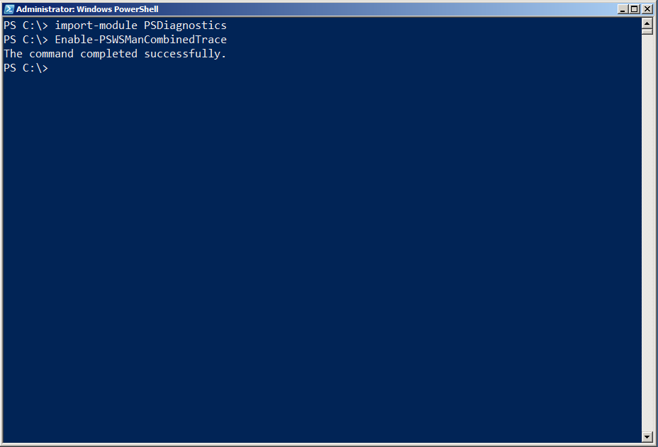

Figura 4.1: Carga del módulo de diagnóstico e inicio de un rastreo

Para cada escenario, seguimos ejecutando uno o más comandos que utilizan Remoting, como se muestra en la figura 4.2. A continuación, desactivamos la traza ejecutando Disable-PSWSManCombinedTrace, de modo que el registro sólo contendrá los detalles de ese intento en particular (borramos el registro entre intentos, para que cada escenario proporcione un nuevo registro de diagnósticos).

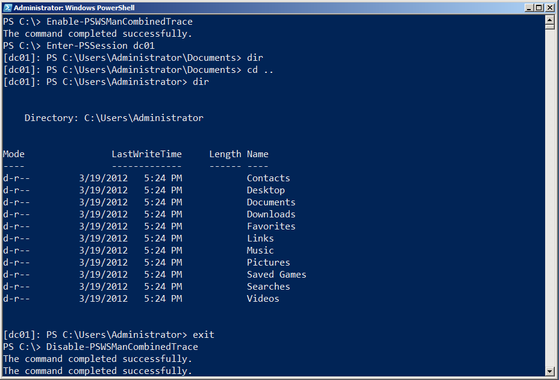

Figura 4.2: Ingresando a una sesión y ejecutando un comando

Finalmente, como se muestra en la figura 4.3, recuperamos los mensajes del registro. En los escenarios que siguen, proporcionaremos una versión detallada de éstos. Tenga en cuenta que típicamente truncaremos gran parte de la salida para poder centrarnos en las partes más significativas. Observe también que hay algo de diferencia al leer la información de la arquitectura del registro de eventos, como lo hacemos en la figura 4.3, y leer el archivo de seguimiento .EVT directamente, como lo haremos en algunos de nuestros escenarios. Este último proporcionará información combinada de diferentes registros, lo que a veces puede ser más útil.

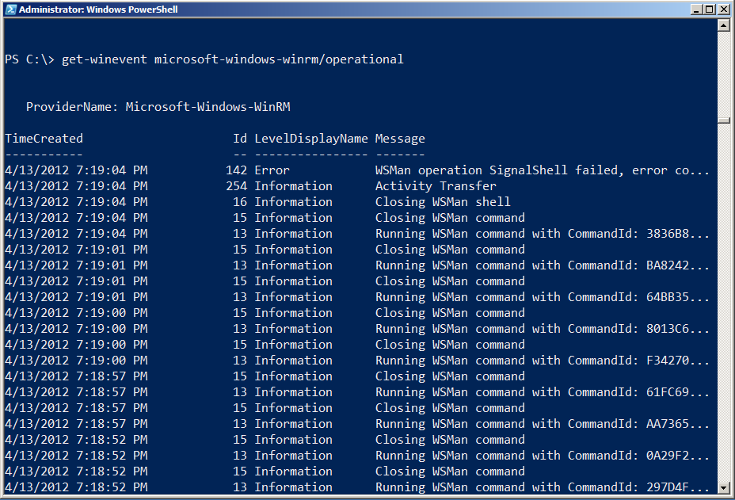

Figura 4.3: Examinar la información de diagnóstico registrada

También vamos a hacer uso del Microsoft-Windows-WinRM/analytic log, que normalmente no contiene información fácilmente legible por humanos. Para utilizar el contenido del registro, utilizaremos un utilitario interno de Microsoft (que se nos ha dado permiso para distribuir y que encontraremos en la página de descargas en http://ConcentratedTech.com) para convertir el contenido del registro en algo que podemos leer.

La información de rastreo se almacena en la carpeta de instalación de PowerShell (ejecute cd $PSHome para llegar allí y luego cambie a la carpeta Traces). La extensión del nombre de archivo es .ETL y puede usar Get-WinEvent -Path Filename.etl para leer un archivo en particular. El comando Construct-PSRemoteDataObject, incluido en el archivo ZIP al que hacemos referencia, puede traducir partes de la propiedad Message del registro analítico en texto (Analytic log's) legible para humanos. Un script de demostración incluido en el archivo ZIP evidencia cómo utilizarlo. Como se muestra en la figura 4.4, hemos utilizado “dot-sourcing” con el archivo Construct-PSRemoteDataObject.ps1 en nuestro shell para obtener acceso a los comandos que expone.

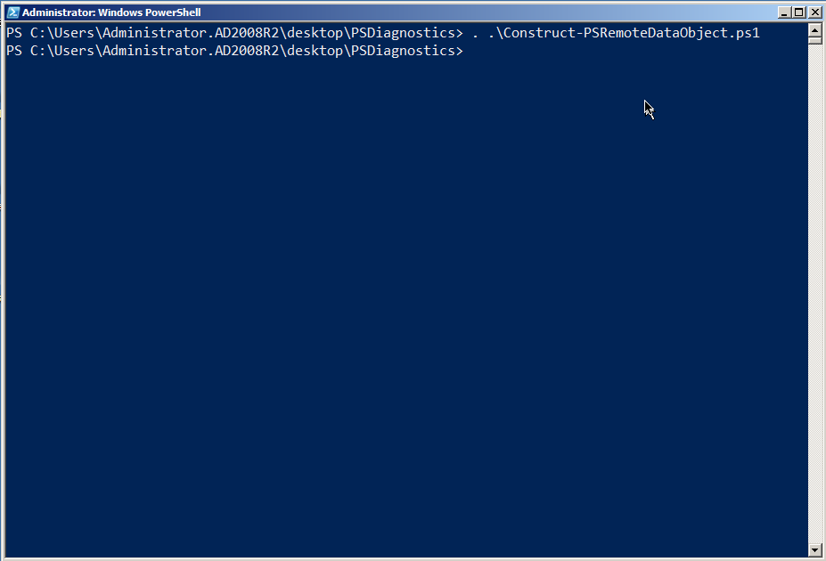

Figura 4.4 Dot-sourcing del script Construct-PSRemoteDataObject.ps1

También eliminamos el contenido de C:\Windows\System32\WindowsPowerShell\v1.0\Traces antes de iniciar cada uno de los ejemplos siguientes.

#### Una conexión remota perfecta

Para esta conexión, pasamos del equipo cliente de Windows 7 en el dominio AD2008R2 al controlador de dominio DC01. En la DC, cambiamos a la carpeta C:\, ejecutamos el comando dir y terminamos la sesión. La Figura 4.5 muestra todo el escenario.

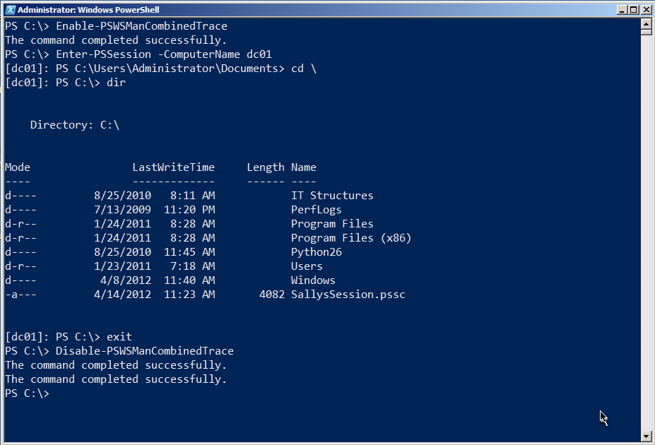

Figura 4.5: Ejemplo completo del escenario

A continuación, leemos el registro en orden cronológico. Tiene que ser cuidadoso. Ejecutando Enable-PSWSManCombinedTrace y Disable-PSWSManCombined se crearan eventos de registro de ellos mismos. A menudo ejecutaremos el comando Enable, y luego esperaremos algunos minutos para hacer cualquier cosa con Remoting. De esa manera, podemos establecer por la marca de tiempo en el registro cuando comenzó el tráfico "real. Esperaremos unos minutos más antes de ejecutar el comando Disable, para que podamos saber fácilmente cuándo finalizó el tráfico de registro "real". También tenga en cuenta que vamos a obtener información de dos registros, WinRM y PowerShell, aunque leer el archivo .ETL con Get-WinEvent tomará todo en secuencia.

**Nota:** hemos experimentado problemas al utilizar Get-WinEvent en PowerShell v3 en máquinas “non-US English”. Si tiene problemas, considere ejecutar el comando desde PowerShell v2 o utilice la aplicación GUI Event Viewer para ver el registro de eventos.

La conexión comienza con (en este ejemplo) Enter-PSSession y la resolución de nombres, como se muestra en la figura 4.6

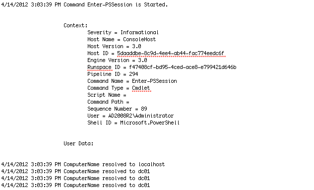

Figura 4.6: Inicio de la conexión remota

WinRM tiene que “iniciar” un espacio de ejecución (esencialmente, un proceso de PowerShell) en el equipo remoto. Esto incluye establecer varias opciones para la configuración regional, la temporización, etc, como se muestra en la figura 4.7.

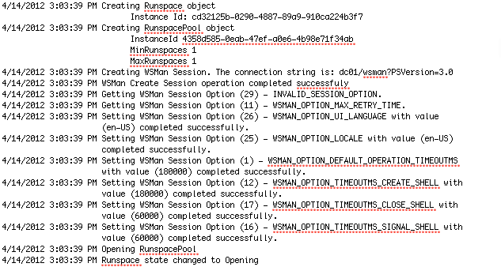

Figura 4.7: Inicio del espacio de ejecución remota

Esto puede tomar un tiempo. Eventualmente, verá que WinRM comienza a enviar "trozos", que son comunicaciones empaquetadas. Estos son enviados a través del Protocolo de Acceso a Objetos Simples, por lo que esperamos ver muchas referencias "SOAP" (WS-MAN es un servicio Web, recuerde, y SOAP es el lenguaje de comunicaciones de los servicios Web). La Figura 4.8 muestra un par de estos trozos de 1500 bytes. Tenga en cuenta que la carga real es más o menos ilegible.

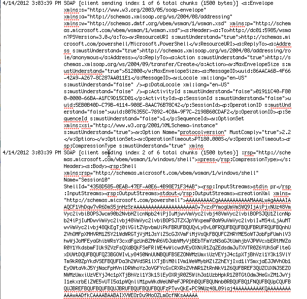

Figura 4.8: Los datos comienzan a transferirse a través de la conexión

Este texto ilegible es lo que el comando Construct-PSRemoteDataObject puede traducir. Por ejemplo, los mensajes de "envío" tienen un ID de evento de 32868. Buscando sólo esos eventos podemos ver lo que se está enviando, como se muestra en la figura 4.9.

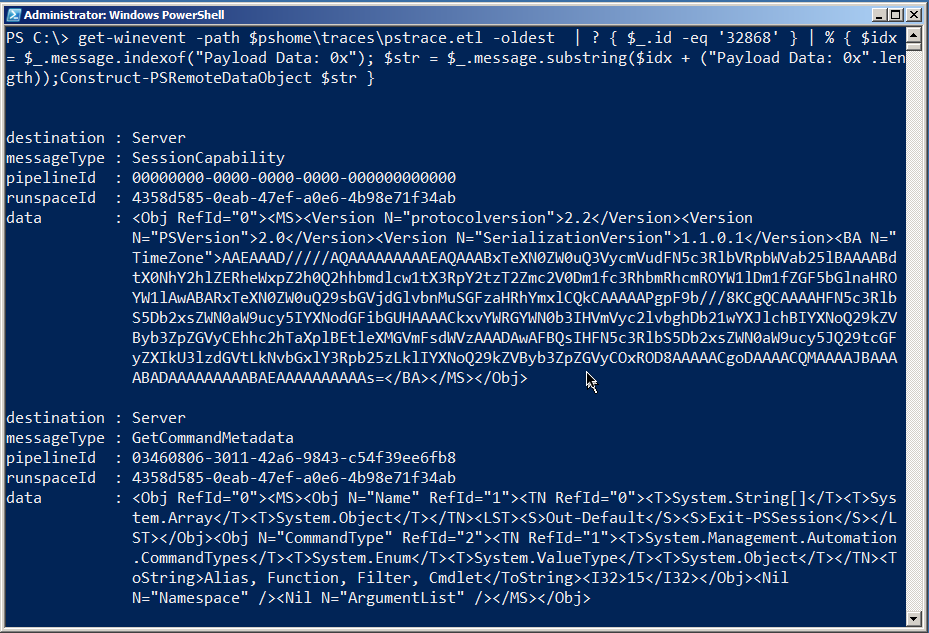

Figura 4.9: Traducir los datos enviados

En este caso, el cliente estaba preguntando al servidor (que está listado como el destino) acerca de sus capacidades y algunos metadatos en el comando Exit-PSSession (que es el segundo mensaje). Así es como el cliente calcula con qué tipo de servidor está hablando, y otra información importante  de manera preliminar. En este punto el cliente sabe qué versión del protocolo de serialización se utilizará para enviar datos de ida y vuelta, en qué zona horaria está el servidor y otros detalles.

**Nota:** Event ID 32868 es tráfico de cliente a servidor; ID 32867 representa tráfico de servidor a cliente. El uso de estos dos IDs junto con Construct-PSRemoteDataObject puede revelar la mayoría del trafico de sesión una vez que se establece la conexión.

Continuando. Como se muestra en la figura 4.10, verá una autenticación de ida y vuelta, durante la cual se pueden esperar algunos errores. El sistema acabará por superarlo y, como se muestra, comenzará a recibir trozos de datos del servidor.

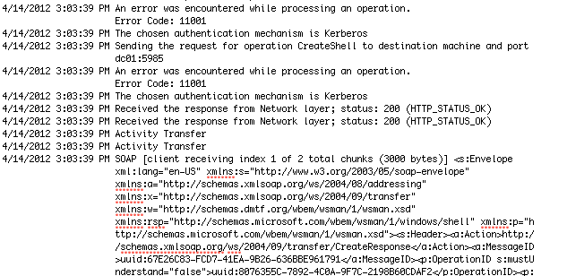

Figura 4.10: Obtención de la autenticación

Una cantidad bastante sorprendente de datos de ida y vuelta puede ocurrir a medida que las dos computadoras intercambian y comparten información sobre el otro y cómo trabajan, y así sucesivamente. Vamos a cambiar nuestra salida del registro de eventos, ahora, para incluir números de ID de evento, porque pueden ser muy útiles al intentar obtener datos específicos. En este punto, el registro consistirá principalmente en el cliente que envía comandos y el servidor que envía los resultados. Esto es más legible cuando se utiliza Construct-PSRemoteDataObject, así que aquí están los datos “de aquí para allá”: Primero aparece la declaración del cliente y de sus capacidades de sesión:

````
destination : Server
messageType : SessionCapability
pipelineId : 00000000-0000-0000-0000-000000000000
runspaceId : 4358d585-0eab-47ef-a0e6-4b98e71f34ab
data    : <Obj RefId="0"><MS><Version
       N="protocolversion">2.2</Version><Version
       N="PSVersion">2.0</Version><Version
       N="SerializationVersion">1.1.0.1</Version><BA N="TimeZon
       e">AAEAAAD/////AQAAAAAAAAAEAQAAABxTeXN0ZW0uQ3VycmVudFN5c
       3RlbVRpbWVab25lBAAAABdtX0NhY2hlZERheWxpZ2h0Q2hhbmdlcw1tX
       3RpY2tzT2Zmc2V0Dm1fc3RhbmRhcmROYW1lDm1fZGF5bGlnaHROYW1lA
       wABARxTeXN0ZW0uQ29sbGVjdGlvbnMuSGFzaHRhYmxlCQkCAAAAAPgpF
       9b///8KCgQCAAAAHFN5c3RlbS5Db2xsZWN0aW9ucy5IYXNodGFibGUHA
       AAACkxvYWRGYWN0b3IHVmVyc2lvbghDb21wYXJlchBIYXNoQ29kZVByb
       3ZpZGVyCEhhc2hTaXplBEtleXMGVmFsdWVzAAADAwAFBQsIHFN5c3Rlb
       S5Db2xsZWN0aW9ucy5JQ29tcGFyZXIkU3lzdGVtLkNvbGxlY3Rpb25zL
       klIYXNoQ29kZVByb3ZpZGVyCOxROD8AAAAACgoDAAAACQMAAAAJBAAAA
       BADAAAAAAAAABAEAAAAAAAAAAs=</BA></MS></Obj>
````

Entonces el servidor:

````
destination : Client
messageType : SessionCapability
pipelineId : 00000000-0000-0000-0000-000000000000
runspaceId : 00000000-0000-0000-0000-000000000000
data    : <Obj RefId="0"><MS><Version
       N="protocolversion">2.2</Version><Version
       N="PSVersion">2.0</Version><Version
       N="SerializationVersion">1.1.0.1</Version></MS></Obj>
````

A continuación se muestra el objeto $PSVersionTable del servidor, que lista varias informaciones de control de versiones:

````
destination : Client
messageType : ApplicationPrivateData
pipelineId : 00000000-0000-0000-0000-000000000000
runspaceId : 4358d585-0eab-47ef-a0e6-4b98e71f34ab
data    : <Obj RefId="0"><MS><Obj N="ApplicationPrivateData"
       RefId="1"><TN RefId="0"><T>System.Management.Automation.
       PSPrimitiveDictionary</T><T>System.Collections.Hashtable
       </T><T>System.Object</T></TN><DCT><En><S
       N="Key">PSVersionTable</S><Obj N="Value"
       RefId="2"><TNRef RefId="0" /><DCT><En><S
       N="Key">PSVersion</S><Version
       N="Value">2.0</Version></En><En><S
       N="Key">PSCompatibleVersions</S><Obj N="Value"
       RefId="3"><TN RefId="1"><T>System.Version[]</T><T>System
       .Array</T><T>System.Object</T></TN><LST><Version>1.0</Ve
       rsion><Version>2.0</Version><Version>3.0</Version></LST>
       </Obj></En><En><S N="Key">BuildVersion</S><Version
       N="Value">6.2.8314.0</Version></En><En><S
       N="Key">PSRemotingProtocolVersion</S><Version
       N="Value">2.2</Version></En><En><S
       N="Key">WSManStackVersion</S><Version
       N="Value">3.0</Version></En><En><S
       N="Key">CLRVersion</S><Version
       N="Value">4.0.30319.261</Version></En><En><S
       N="Key">SerializationVersion</S><Version N="Value">1.1.0
       .1</Version></En></DCT></Obj></En></DCT></Obj></MS></Obj
       >
````

A continuación, el servidor envía información sobre el espacio de ejecución que se utilizará:

````
destination : Client
messageType : RunspacePoolStateInfo
pipelineId : 00000000-0000-0000-0000-000000000000
runspaceId : 4358d585-0eab-47ef-a0e6-4b98e71f34ab
data    : <Obj RefId="0"><MS><I32
       N="RunspaceState">2</I32></MS></Obj>
````

El cliente envía información sobre su comando Exit-PSSession:

````
destination : Server
messageType : GetCommandMetadata
pipelineId : 03460806-3011-42a6-9843-c54f39ee6fb8
runspaceId : 4358d585-0eab-47ef-a0e6-4b98e71f34ab
data    : <Obj RefId="0"><MS><Obj N="Name" RefId="1"><TN RefId="0"
       ><T>System.String[]</T><T>System.Array</T><T>System.Obje
       ct</T></TN><LST><S>Out-Default</S><S>Exit-PSSession</S><
       /LST></Obj><Obj N="CommandType" RefId="2"><TN RefId="1">
       <T>System.Management.Automation.CommandTypes</T><T>Syste
       m.Enum</T><T>System.ValueType</T><T>System.Object</T></T
       N><ToString>Alias, Function, Filter,
       Cmdlet</ToString><I32>15</I32></Obj><Nil N="Namespace"
       /><Nil N="ArgumentList" /></MS></Obj>
````

Un poco más adelante veremos el resultado del comando CD C:\, que un nuevo mensaje de PowerShell que refleja la nueva ubicación de la carpeta:

````
destination : Client
messageType : PowerShellOutput
pipelineId : c913b8ae-2802-4454-9d9b-926ca6032018
runspaceId : 4358d585-0eab-47ef-a0e6-4b98e71f34ab
data    : <S>PS C:\&gt; </S>
````
A continuación, veremos la salida del comando Dir. El primer bit define los encabezados de columna para Mode, LastWriteTime, Length, Name y así sucesivamente. Todo esto se envía a nuestro cliente - solo incluiremos las primeras líneas, cada una de las cuales aparece en su propio bloque:

````
destination : Client
messageType : RemoteHostCallUsingPowerShellHost
pipelineId : c259c891-516a-46a7-b287-27c96ff86d5b
runspaceId : 4358d585-0eab-47ef-a0e6-4b98e71f34ab
data    : <Obj RefId="0"><MS><I64 N="ci">-100</I64><Obj N="mi"
       RefId="1"><TN RefId="0"><T>System.Management.Automation.
       Remoting.RemoteHostMethodId</T><T>System.Enum</T><T>Syst
       em.ValueType</T><T>System.Object</T></TN><ToString>Write
       Line2</ToString><I32>16</I32></Obj><Obj N="mp"
       RefId="2"><TN RefId="1"><T>System.Collections.ArrayList<
       /T><T>System.Object</T></TN><LST><S>Mode        
       LastWriteTime   Length Name             
                  </S></LST></Obj></MS></Obj>
destination : Client
messageType : RemoteHostCallUsingPowerShellHost
pipelineId : c259c891-516a-46a7-b287-27c96ff86d5b
runspaceId : 4358d585-0eab-47ef-a0e6-4b98e71f34ab
data    : <Obj RefId="0"><MS><I64 N="ci">-100</I64><Obj N="mi"
       RefId="1"><TN RefId="0"><T>System.Management.Automation.
       Remoting.RemoteHostMethodId</T><T>System.Enum</T><T>Syst
       em.ValueType</T><T>System.Object</T></TN><ToString>Write
       Line2</ToString><I32>16</I32></Obj><Obj N="mp"
       RefId="2"><TN RefId="1"><T>System.Collections.ArrayList<
       /T><T>System.Object</T></TN><LST><S>----        
       -------------   ------ ----             
                  </S></LST></Obj></MS></Obj>
destination : Client
messageType : RemoteHostCallUsingPowerShellHost
pipelineId : c259c891-516a-46a7-b287-27c96ff86d5b
runspaceId : 4358d585-0eab-47ef-a0e6-4b98e71f34ab
data    : <Obj RefId="0"><MS><I64 N="ci">-100</I64><Obj N="mi"
       RefId="1"><TN RefId="0"><T>System.Management.Automation.
       Remoting.RemoteHostMethodId</T><T>System.Enum</T><T>Syst
       em.ValueType</T><T>System.Object</T></TN><ToString>Write
       Line2</ToString><I32>16</I32></Obj><Obj N="mp"
       RefId="2"><TN RefId="1"><T>System.Collections.ArrayList<
       /T><T>System.Object</T></TN><LST><S>d----    
       8/25/2010  8:11 AM      IT Structures      
                     </S></LST></Obj></MS></Obj>
destination : Client
messageType : RemoteHostCallUsingPowerShellHost
pipelineId : c259c891-516a-46a7-b287-27c96ff86d5b
runspaceId : 4358d585-0eab-47ef-a0e6-4b98e71f34ab
data    : <Obj RefId="0"><MS><I64 N="ci">-100</I64><Obj N="mi"
       RefId="1"><TN RefId="0"><T>System.Management.Automation.
       Remoting.RemoteHostMethodId</T><T>System.Enum</T><T>Syst
       em.ValueType</T><T>System.Object</T></TN><ToString>Write
       Line2</ToString><I32>16</I32></Obj><Obj N="mp"
       RefId="2"><TN RefId="1"><T>System.Collections.ArrayList<
       /T><T>System.Object</T></TN><LST><S>d----    
       7/13/2009 11:20 PM      PerfLogs        
                     </S></LST></Obj></MS></Obj>
````

Finalmente, el comando finaliza y recibimos el “prompt” de nuevo:

````
destination : Client
messageType : PowerShellOutput
pipelineId : f5c8bc7a-ec54-4180-b2d4-86479f9ea4b9
runspaceId : 4358d585-0eab-47ef-a0e6-4b98e71f34ab
data    : <S>PS C:\&gt; </S>
````
También verá intercambios periódicos sobre el estado de la tubería (pipeline) - esto indica que el comando ha finalizado

````
destination : Client
messageType : PowerShellStateInfo
pipelineId : f5c8bc7a-ec54-4180-b2d4-86479f9ea4b9
runspaceId : 4358d585-0eab-47ef-a0e6-4b98e71f34ab
data    : <Obj RefId="0"><MS><I32
       N="PipelineState">4</I32></MS></Obj>
````

Definitivamente hay una gran cantidad de datos que pasan de un lado a otro, pero es posible entenderlo usando estas herramientas. Francamente, la mayoría de los problemas de Remoting se producen durante la fase de conexión, es decir, que una vez se haya conectado, es bastante probable que no tenga más problemas. Así que en los próximos escenarios, nos centraremos en errores de conexión específicos.

**Nota:** Para borrar el registro y prepararse para una nueva traza, usualmente eliminamos los archivos .ETL y entramos en el Visor de sucesos para borrar los registros de Applications and Services Logs > Microsoft > Windows > Windows Remote Management. Si está recibiendo errores al ejecutar Enable-PSWSManCombinedTrace, una de esas dos tareas probablemente no se ha completado.

#### Problema de conexión: puerto bloqueado

La Figura 4.11 muestra lo que sucede cuando intenta conectarse a una computadora y el puerto necesario (5985 por defecto) no está abierto. Veamos cómo esto aparece en el registro. Tenga en cuenta que estamos asumiendo que ya ha comprobado el nombre del equipo y se aseguró de que se resuelve a la dirección IP correcta. Lo que está viendo es definitivamente un puerto bloqueado (porque lo configuramos de esa manera) en este ejemplo.

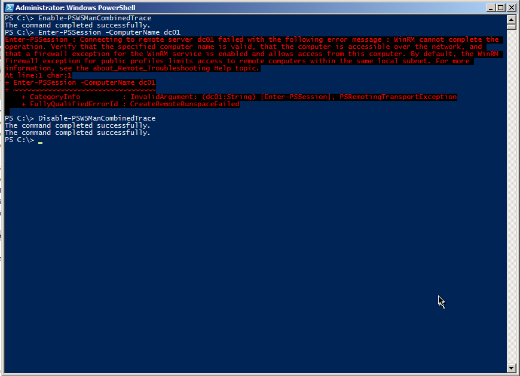

Figura 4.11: Error de conexión debido a un cortafuegos u otro problema de bloqueo de puertos.

La Figura 4.12 muestra que hemos resuelto satisfactoriamente el nombre del equipo. Encontramos que las pruebas con Enter-PSSession son las más fáciles, porque es muy sencillo detectar ese comando en el registro y ver cuándo empiezan los datos de registro "reales".

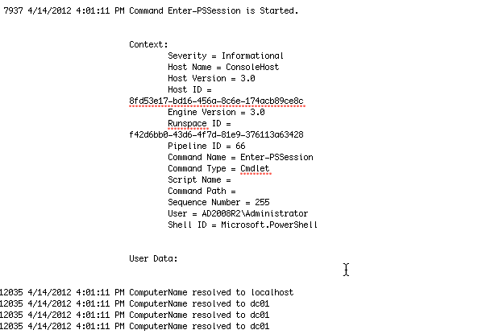

Figura 4.12: Inicio del intento de conexión

Tenga en cuenta que gran parte del tráfico de registro inicial sigue siendo WinRM hablando por sí mismo mientras se alista para el intento de conexión real. Simplemente continúe desplazándose hasta que comience a ver las indicaciones de problemas. La Figura 4.13 muestra un tiempo de espera - nunca una buena señal - y el mensaje de error generado por WinRM. Como puede ver, esto es exactamente lo que tenemos en la pantalla, por lo que PowerShell no está ocultándonos nada.

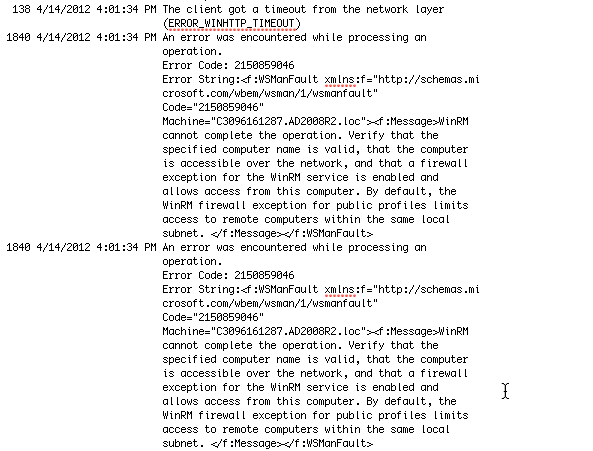

Figura 4.13: El error de tiempo de espera en el registro de diagnósticos

Éste es realmente una de las cosas más difíciles de Remoting. No le puede decir porqué el servidor no respondió. No se da cuenta que el puerto no está abierto. Podríamos haber especificado un nombre de computadora que no existe. Todo lo que sabe WinRM  es que se envió un mensaje a la red y nadie respondió. Al final, casi todos los posibles problemas de "nivel bajo" – son una dirección IP errada, un nombre incorrecto de la computadora, un puerto bloqueado, etc. Son iguales desde el punto de vista de WinRM. Usted tendrá que solucionar estos problemas.

Hemos encontrado que una técnica útil puede ser usar el antiguo cliente de Telnet de línea de comandos. Tenga en cuenta que WS-MAN es sólo HTTP, y HTTP, como muchos protocolos de Internet, simplemente envía texto de un lado a otro, más o menos lo mismo que hace Telnet. HTTP tiene un texto específico para enviar y recibir, pero la transmisión real es Telnet de la vieja escuela. Así que vamos a ejecutar algo como telnet dc01 5985 sólo para ver si podemos conectar. Una pantalla en blanco es normal: pulsa Ctrl + C para salir, y verá un error HTTP "Solicitud incorrecta". Eso está bien. Al menos confirma que el nombre del equipo, la dirección IP, el puerto y todo lo demás "de bajo nivel" está bien.

#### Problema de conexión: Sin Permisos

Esto puede ser un problema complicado, ya que necesita ser un administrador para habilitar una traza de diagnóstico. Por otra parte, WinRM suele ser bastante claro cuando no se puede conectar porque su cuenta no tiene permiso para el punto final: "Acceso denegado" es el mensaje de error, y eso es bastante sencillo.

Pero también puede iniciar sesión como administrador (o abrir un shell bajo Credenciales de administrador), habilitar una traza y, a continuación, hacer que el otro usuario (o la otra cuenta de usuario) lo intente. Volver atrás como administrador y deshabilitar la traza y a continuación examinar el registro. La Figura 4.14 muestra lo que está buscando.

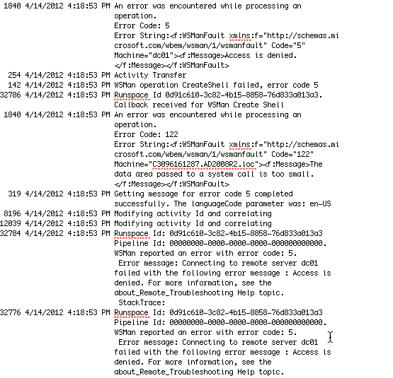

Figura 4.14: "Acceso denegado" en el registro de diagnósticos

Los datos de registro le mostrarán la cuenta de usuario que se utilizó para intentar crear la conexión (AD2008R2\SallyS, en nuestro ejemplo, por lo que el comando falló - ella no es un administrador). Una comprobación rápida con Get-PSSessionConfiguration en el equipo remoto confirmará los permisos en cualquier punto final de Remoting al que intente conectarse. Además, como se muestra en la figura 4.15, hemos descubierto que ejecutar Set-PSSessionConfiguration puede ser útil. Proporcione el -nombre del punto final que está comprobando y agregue -ShowSecurityDescriptorUI. Eso le permitirá confirmar los permisos del punto final en un formulario GUI más amigable, y puede modificarlo allí mismo si es necesario.

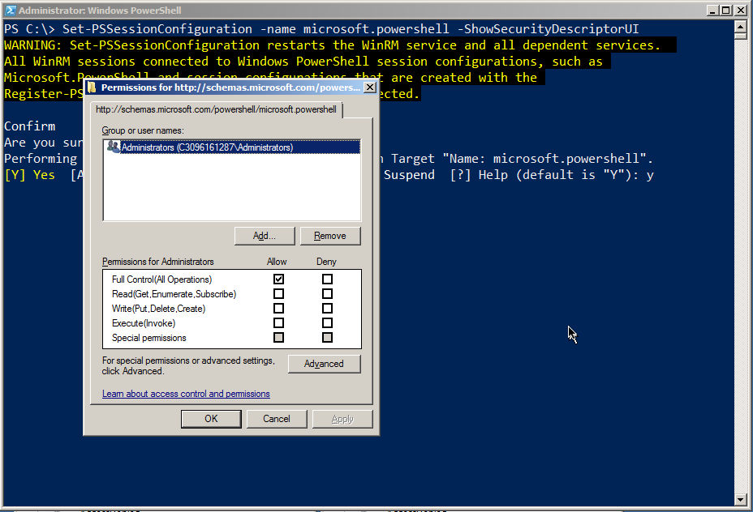

Figura 4.15: Comprobación de los permisos de un punto final mediante Set-PSSessionConfiguration

#### Problema de conexión: Host no confiable

La Figura 4-16 muestra la conexión que estamos intentando realizar: Desde el cliente en el dominio AD2008R2 a un equipo independiente que no forma parte de un dominio.

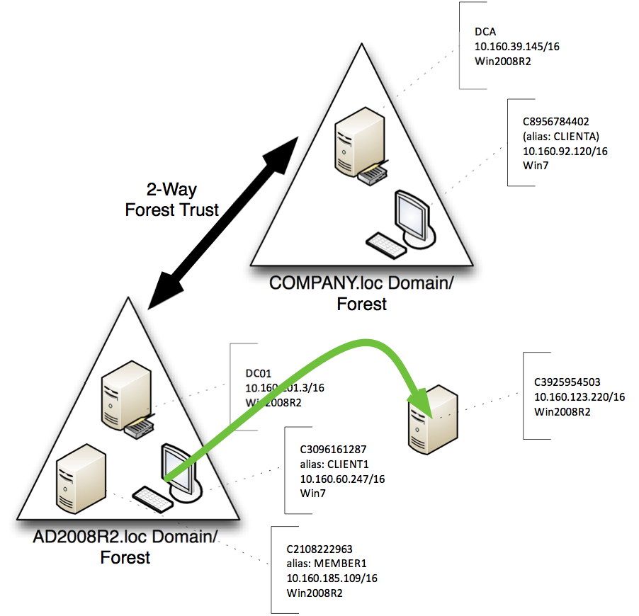

Figura 4.16: Tentativa de conexión para este escenario

Como se muestra en la figura 4.17, el error se produce rápidamente, aunque hemos proporcionado una credencial válida. El problema es que estamos en una situación en la que WinRM no puede obtener la autenticación mutua que requiere. La parte 2 de esta guía cubre soluciones para este problema. Pero, ¿cómo se ve el problema en el registro de diagnósticos?

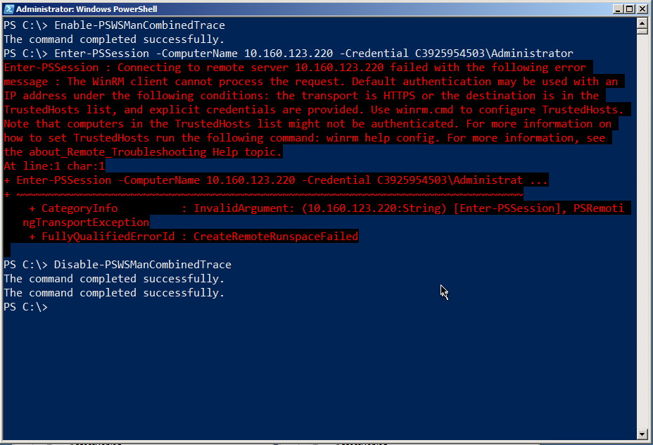

Figura 4.17: El mensaje de error da buenas pistas sobre cómo resolver este problema

La Figura 4.18 muestra que WinRM todavía envía su salva inicial de tráfico al servidor. Es cuando la respuesta vuelve que el cliente se da cuenta que no puede autenticar este servidor, y se genera el error. Lo que ve en el registro es más o menos lo que aparece en el shell, literalmente.

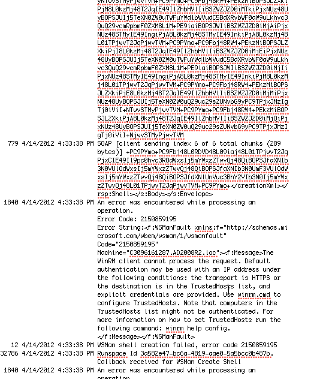

Figura 4.18: El contenido del registro de diagnóstico al intentar conectarse a un host no confiable

La Figura 4.19 muestra un buen segundo paso: Ejecutar Test-WSMan. Proporcione el mismo nombre de equipo o dirección IP, pero deje fuera el parámetro -Credential. El Cmdlet puede al menos indicarle que WS-MAN y WinRM están funcionando en el equipo remoto y la versión que están ejecutando. Eso, por lo menos, reduce el problema a uno de autenticación: o bien sus permisos (que habrían resultado en un "Acceso denegado") o el componente de autenticación mutua de Remoting.

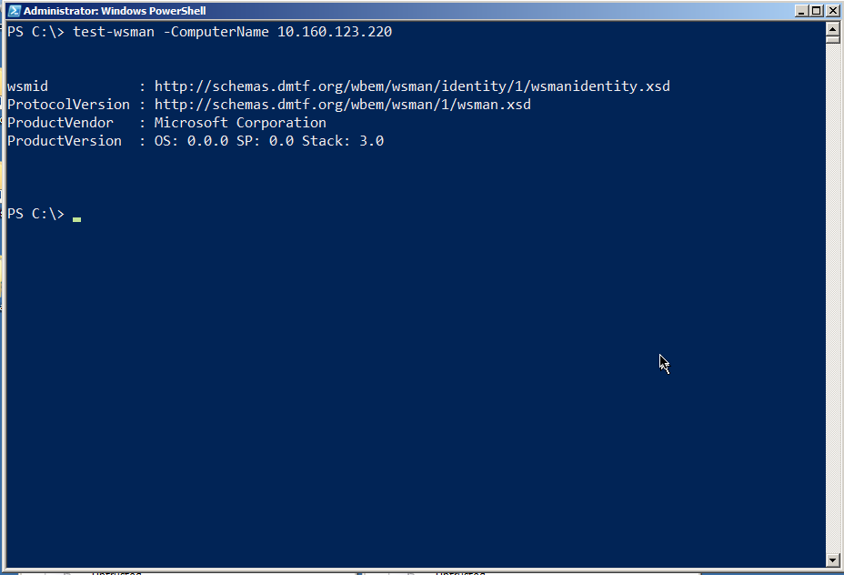

Figura 4.19: Test-WSMan es como un "ping" para Remoting

**Nota:** Verá prácticamente el mismo comportamiento cuando intenta conectarse mediante HTTPS (el conmutador -UseSSL en los distintos comandos de Remoting) y el nombre del certificado SSL de la máquina remota no coincide con el nombre que utilizó en su comando. El mensaje de error es inequívoco tanto en pantalla como en el registro, y discutiremos las soluciones en la parte 2 de la guía.

## Metodología Estándar de Solución de Problemas

Solucionar problemas puede ser difícil, especialmente con Remoting ya que hay muchas capas en las que algo puede salir mal. Seguir un enfoque sencillo y estandarizado puede ayudarle a identificar problemas.

1. Probar Remoting con su configuración predeterminada. Si ha cambiado algo, deshacer los cambios y empezar de cero.
Comience por intentar conectarse desde la máquina iniciadora a la máquina de destino utilizando algo distinto de Remoting, pero que siga siendo sensible a la seguridad. Por ejemplo, utilice el Explorador de Windows para abrir la carpeta compartida C$ de la máquina remota. 

2. Si eso no funciona, tiene problemas de seguridad más generales. Anote si necesita o no proporcionar credenciales alternativas - si lo hace, Remoting las necesitará también.

3. Instalar un cliente Telnet en la máquina iniciadora (un simple cliente de línea de comandos, como el que viene con Windows). Intente conectarse al oyente HTTP WinRM ejecutando telnet nombre_máquina: 5985. Debería obtener una pantalla en blanco y Ctrl + C finalizará la sesión. Si esto no funciona, hay un problema básico de conectividad (como un puerto bloqueado) que necesita resolver.

4. Utilice Test-WSMan como se describió anteriormente, utilizando una credencial alternativa si es necesario. Asegúrese de que utiliza el nombre real de la máquina tal como aparece en Active Directory o que ha tomado uno de los otros enfoques (TrustedHosts más una credencial o SSL más una credencial) que describimos en la Sección 2 de esta guía. Si eso no funciona, tiene un problema en la configuración de WS-MAN

Simplemente avanzar por estos cuatro pasos, en este orden, puede ayudarle a identificar al menos la causa general de la mayoría de los problemas.

## Resumen

Entonces, ¿por qué nos molestábamos en pasar por los registros cuando, en la mayoría de nuestros ejemplos, los registros simplemente hacían eco de lo que estaba en la pantalla? Simple: A medida que PowerShell se inserta en más y más aplicaciones GUI, es posible que no siempre tenga una consola, con sus mensajes de errores agradables, en la que confiar. Lo que puede hacer, sin embargo, es usar la consola para iniciar un seguimiento, ejecutar cualquier aplicación GUI que este fallando y luego buscar en el registro para ver si encuentra algunos de los signos que le hemos mostrado aquí.


