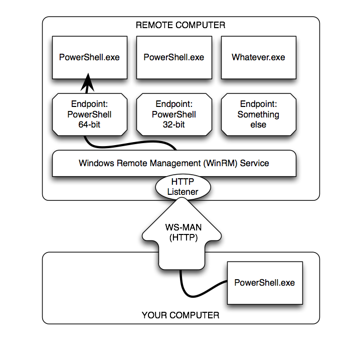
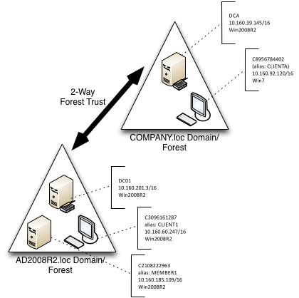
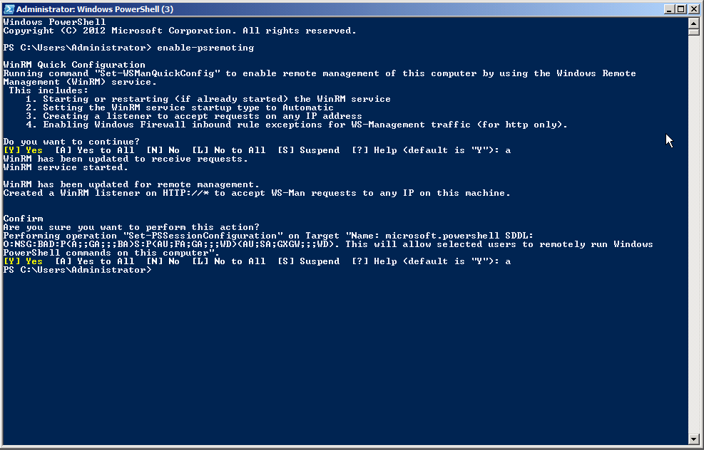
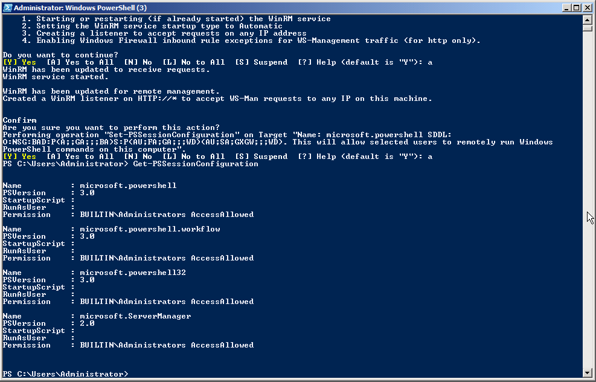
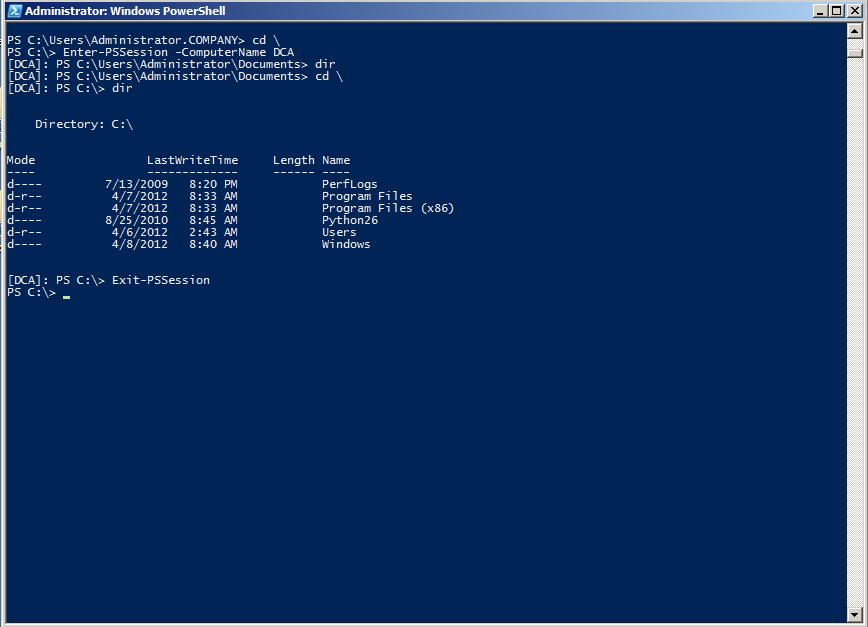

# Fundamentos de Remoting

Windows PowerShell 2.0 introdujo una potente tecnología, Remoting, refinada y ampliada en PowerShell 3.0. Basada principalmente en protocolos y técnicas estandarizadas, el sistema de Remoting es posiblemente uno de los aspectos más importantes de PowerShell: los futuros productos de Microsoft se basarán en él casi en su totalidad para las comunicaciones administrativas a través de una red.

Desafortunadamente, Remoting es también un sistema complejo de componentes, y mientras que Microsoft ha intentado proporcionar la dirección sólida para usarla en una variedad de escenarios, muchos administradores todavía luchan con esta. Este "mini e-book" está diseñado para ayudarle a entender mejor lo que es el Remoting, cómo funciona y, lo que es más importante, cómo usarlo en una variedad de situaciones diferentes.

**Nota** Tenga en cuenta que esta guía no pretende reemplazar la gran variedad de libros existentes que cubren los fundamentos de Remoting, como el propio _Learn Windows PowerShell in a Month of Lunches_ (http://morelunches.com) de Don Jones o _PowerShell in Depth_. En su lugar, esta guía complementa a aquellas que proporcionan instrucciones paso a paso para muchos de los escenarios "alrededor" de un sistema de comunicación remota, e intenta explicar algunos de los comportamientos y requerimientos de los sistemas remotos más inusuales.

## ¿Qué es Remoting?

En esencia, el acceso remoto le permite acceder a máquinas remotas a través de una red y recuperar datos o ejecutar código en una o varias computadoras remotas. Esto no es una idea nueva. Ya en el pasado una serie de diferentes tecnologías remotas han intentado lo mismo. Algunos Cmdlets de PowerShell han proporcionado tradicionalmente capacidades propias de acceso remoto limitadas, mientras que la mayoría de los Cmdlets no admiten la conexión remota por su propia cuenta.

Con PowerShell Remoting se encuentra finalmente un entorno genérico que permite la ejecución remota para, literalmente, cualquier comando que se puede ejecutar en una instanica de PowerShell de forma local. Por lo que en lugar de agregar capacidades de acceso remoto a cada Cmdlet y/o aplicación, simplemente se deja a PowerShell transferir la ejecución de su código al equipo de destino y a continuación, enviar los resultados de vuelta.

A lo largo de este libro nos centraremos en el control remoto de PowerShell pero no cubriremos las funciones remotas privadas no estándar incorporadas en algunos Cmdlets seleccionados
.

## Examinando la arquitectura de Remoting

Como se muestra en la figura 1.1, la arquitectura remota genérica de PowerShell se compone de numerosos componentes y elementos diferentes e interrelacionados.



Figura 1.1: Los elementos y componentes de PowerShell Remoting

Aquí está la lista completa:

- En la parte inferior de la figura está su computadora, o más correctamente su cliente. Es donde usted se sienta físicamente, y donde iniciará la mayor parte de sus actividades de control remoto. 

- Su computadora se comunicará a través de WS-MAN, o del protocolo de servicios web para la administración. Este es un protocolo basado en http(s) que puede encapsular una variedad de tipos de comunicación. Hemos ilustrado el uso de  http, que es la configuración predeterminada, pero también podría ser fácilmente https

- En el equipo remoto, en la terminología adecuada, el servidor (que no hace referencia al sistema operativo), ejecuta el servicio de administración remota de Windows (WinRM). Este servicio está configurado para tener uno o más oyentes. Cada oyente espera el tráfico entrante de WS-MAN en un puerto específico, cada uno ligado a un protocolo específico (http o https), y en direcciones IP específicas (o todas las direcciones locales)

- Cuando un oyente recibe tráfico, el servicio WinRM busca el EndPoint a donde se debe enviar el  tráfico. Para nuestro propósito, un EndPoint usualmente estará asociado con una instancia de Windows PowerShell. En términos de PowerShell, un EndPoint también se denomina una configuración de sesión. Esto se debe a que además de lanzar PowerShell, se pueden cargar secuencias de comandos y módulos, agregar restricciones sobre lo que puede hacer el usuario conectado y aplicar configuraciones adicionales de sesión específicas que no se mencionan aquí.

**Nota** Aunque mostramos **powershell.exe** en nuestro diagrama, eso solo para propósitos de ilustración. **Powershell.exe** es la aplicación de consola de PowerShell, y no tendría sentido tener esta ejecución como un proceso de fondo en un equipo remoto. El proceso real se denomina **wsmprovhost.exe**, que aloja PowerShell en segundo plano para conexiones remotas.

Como se puede ver, un único equipo remoto puede tener fácilmente decenas o incluso cientos de EndPoints, cada uno con una configuración diferente. PowerShell 3.0 configura tres EndPoints por defecto: uno para PowerShell de 32 bits (en sistemas de 64 bits), un EndPoint de PowerShell por defecto (que es de 64 bits en sistemas x64) y otro para PowerShell Workflow. Comenzando con Windows Server 2008 R2, hay un cuarto EndPoint predeterminado para las tareas de Server Manager Workflow.

## Habilitando Remoting

La mayoría de las versiones cliente de Windows, iniciando con Windows Vista, no habilitan las conexiones remotas entrantes de forma predeterminada, aunque las versiones de servidor más recientes de Windows vienen con Remoting habilitado. El primer paso con Remoting suele ser habilitarlo en los equipos en que se desean recibir conexiones entrantes. Hay tres maneras de habilitar Remoting. La tabla 1.1 compara lo que se puede lograr con cada una de ellas.

Tabla 1.1 comparando las maneras de habilitar Remoting

|  | Enable-PSRemoting | Política de grupo | Manualmente paso a paso |
| --- | --- | --- | --- |
| Establecer WinRM para auto-iniciar e iniciar el servicio | Si | Si | Si - utilice **Set-Service** y **Start-Service**. |
| Configurar el detector de HTTP | Si | Puede configurar el registro automático de Listeners, sin crear Listeners personalizados | Si - Utilice la utilidad de línea de comandos WSMAN y la unidad **WSMAN:** de PowerShell |
| Configurar el detector de HTTPS | No | No | Si - Utilice la utilidad de línea de comandos WSMAN y la unidad **WSMAN:** de PowerShell |
| Configurar EndPoints / Configurar sesiones | Si | No | Si - utilice el Cmdlet PSSessionConfiguration |
| Configurar la excepción de Firewall de Windows | Si\* | Si\* | Si\* - Utilice Cmdlets del Firewall o la GUI del Firewall de Windows |

**Nota** Tenga en cuenta que las versiones existentes de cliente de Windows, como Windows Vista, no permiten excepciones de Firewall en una red identificada como "pública". Las redes deben ser "casa" o "trabajo/dominio" para permitir excepciones. En PowerShell 3.0, se puede ejecutar **Enable-PSRemoting** con el modificador **-SkipNetworkProfileCheck** para evitar este problema..

Estaremos habilitando la administración remota en nuestro entorno de prueba ejecutando **Enable-PSRemoting**. Es rápido, fácil e incluye todo lo necesario. También vera una gran cantidad de tareas manuales a realizar en las siguientes secciones.

## Entorno de pruebas

Usaremos un entorno de pruebas consistente en las siguientes secciones. Consiste en seis máquinas virtuales en _cloudshare.com_ configuradas como se muestra en la figura 1.2.



Figura 1.2: configuración del entorno de pruebas

Algunas notas importantes:

- .NET Framework v4 y PowerShell 3.0 están instalados en todos los equipos. La mayor parte de lo que cubriremos también se aplica a PowerShell 2.0.

- Como se muestra, la mayoría de las computadoras tienen un nombre de computadora numérico (c2108222963, y así sucesivamente); El controlador de dominio para cada dominio (que también es un servidor DNS) tiene registros CNAME con nombres más fáciles de recordar.

- Cada controlador de dominio tiene un reenviador condicional configurado para el otro dominio, de modo que las máquinas de cualquiera de los dominios puedan resolver nombres de equipos en el otro dominio.

- Realizamos todas las tareas como miembro del grupo de administradores del dominio, a menos que se indique lo contrario.

- Creamos un sexto servidor completamente independiente que no está en ningún dominio. Esto será útil para cubrir algunas de las situaciones que no son de dominio con las que puede encontrarse en un sistema de comunicación remota.

**Tenga cuidado** al abrir PowerShell en un equipo que tenga habilitado el control de cuenta de usuario (UAC), asegúrese de hacer clic con el botón derecho en el icono de PowerShell y seleccione “Ejecutar como administrador”. Si la barra de título de la ventana PowerShell resultante no comienza con la palabra Administrador: entonces no tiene privilegios administrativos. Puede comprobar los permisos de forma programática con esto _(whoami /all | select-string S-1-16-12288) -ne $null_ en una consola de PowerShell. En un Shell con permisos de administrador se devuelve **True**, de lo contrario será **False**.

## Primeros pasos con Remoting

Comenzamos ejecutando Enable-PSRemoting en las seis computadoras. Debemos asegurarnos que el comando finaliza sin errores. Cualquier error en este punto es una señal para se detenga y resuelva el error antes de intentar continuar. La figura 1.3 muestra la salida esperada.



Figura 1.3: salida esperada de Enable-PSRemoting

**Nota**: Observara un uso desmedido de capturas de pantalla a lo largo de esta guía. Me permiten asegurar que no cometo errores ortográficos o  errores del tipo copiar/pegar. Verá exactamente lo que escribimos y los resultados de su ejecución.

Ejecutar Get-PSSessionConfiguration debe revelar los tres o cuatro EndPoints creados por Enable-PSRemoting. La figura 1.4 muestra la salida esperada en uno de los servidores.



Figura 1.4: Salida esperada de Get-PSSessionConfiguration

**Nota**: la figura 1.4 ilustra que se puede esperar que diferentes EndPoints se configuren en diferentes máquinas. Este ejemplo fue con un servidor Windows 2008 R2 equipo, que tiene menos EndPoints que una máquina con Windows 2012.

Vale la pena tomar un momento para comprobar rápidamente la configuración de Remoting. Para los equipos que forman parte del mismo dominio, al iniciar sesión como administrador de dominio de ese dominio, el sistema de comunicación remota debería "funcionar". Compruébelo rápidamente conectarse de una computadora a otra usando Enter-PSSession. 

**Nota**: en otros entornos, es posible que una cuenta de administrador de dominio no sea la única que pueda usar Remoting. Si en su hogar o entorno de trabajo se tienen cuentas adicionales en el grupo de administradores locales como estándar en su dominio, también podrá utilizar esas cuentas para realizar llamadas remotas.

La figura 1.5 muestra la salida esperada, en la que también ejecutamos un comando dir rápido y luego salimos de la sesión remota.



Figura 1.5: comprobación de la conectividad remota desde el cliente al controlador de dominio DCA.

**Precaución**: si está configurando su propio entorno de pruebas, no continúe hasta que haya confirmado la conectividad de los sistemas remotos entre dos equipos del mismo dominio. Por ahora no necesitamos comprobar otros escenarios.

## Tareas “core” de Remoting

PowerShell proporciona dos escenarios principales para el uso de Remoting. El primero, Remoting 1-a-1, es similar en su naturaleza  al shell SSH disponible en sistemas UNIX y Linux. Con él, obtendrá acceso a una línea de comandos en un único equipo remoto. El segundo, Remoting  1-a-muchos, permite enviar un comando (o una lista de comandos) en paralelo, a un conjunto de equipos remotos. Hay otro par de técnicas secundarias útiles que veremos más adelante.

### Remoting 1-a-1 
El comando Enter-PSSession se conecta a un equipo remoto y permite el acceso a una línea de comandos en ese equipo. Puede ejecutar cualquier comando en dicho equipo, siempre y cuando tenga permiso para realizar esa tarea. Tenga en cuenta que no está creando un inicio de sesión interactivo. La conexión se auditará como un inicio de sesión de red, al igual que si se estuviera conectando al recurso compartido administrativo C$ de la computadora. PowerShell no cargará ni procesará las secuencias de comandos del perfil de usuario en el equipo remoto. Cualquier script que elija ejecutar (y esto incluye la importación de módulos de script) sólo funcionará si la política de ejecución de la máquina remota lo permite.

```
Enter-PSSession -computerName DC01
```

**Nota**: Mientras esté conectado a una máquina remota a través de Enter-PSSession, el “prompt” de la línea de comandos cambia y muestra el nombre del sistema remoto al que está conectado entre corchetes. Si ha personalizado su “prompt”, todas esas personalizaciones se perderán porque el “prompt” se creará en el sistema remoto y se transferirá de regreso a usted. Todas las entradas de teclado se envían a la máquina remota, y todos los resultados son devueltos a usted. Es importante tener en cuenta esto porque no puede utilizar Enter-PSSession en un script. Si lo hace, el script seguiría ejecutándose en su máquina local, ya que no se ingresó ningún código (en el teclado) de forma interactiva.

### Remoting 1-a-muchos

Con esta técnica, se especifican uno o más nombres de equipo y un comando (o una lista de comandos separados por punto y coma). PowerShell envía los comandos, a través de Remoting, a los equipos especificados. Esas computadoras ejecutan los comandos, serializan los resultados en XML y transmiten los resultados de vuelta. El equipo deserializa el XML de nuevo en objetos y los coloca en la canalización (pipeline) de la sesión de PowerShell. Esto se logra a través del Cmdlet Invoke-Command.

```
Invoke-Command -computername DC01,CLIENT1 -scriptBlock { Get-Service }
```

Si tiene una secuencia de comandos para ejecutar, puede hacer que Invoke-Command la lea, transmita el contenido a los equipos remotos y haga que se ejecuten dichos comandos.

```
Invoke-Command -computername DC01,CLIENT1 -filePath c:\Scripts\Task.ps1
```

Tenga en cuenta que Invoke-Command, de forma predeterminada, se comunicará con hasta 32 equipos a la vez. Si especifica más, los equipos extra se pondrán en cola e Invoke-Command comenzará a procesarlos al terminar los primeros 32. El parámetro -ThrottleLimit puede aumentar este límite. El único costo es para su computadora, ya que debe tener recursos suficientes para mantener una sesión única de PowerShell para cada equipo al que esté contactando simultáneamente. Si espera recibir grandes cantidades de datos de los equipos remotos, el ancho de banda de red disponible puede ser otro factor limitante.

### Sesiones

Cuando ejecuta Enter-PSSession o Invoke-Command y utiliza el parámetro -ComputerName, Remoting crea una conexión (o sesión), hace lo que se le pidió y luego cierra la conexión (en el caso de una sesión interactiva creada con Enter-PSSession, PowerShell sabe que ha terminado cuando ejecuta Exit-PSSession). Hay algunas sobrecargas involucradas en esa configuración y arranque, por lo que PowerShell también ofrece la opción de crear una conexión persistente, llamada PSSession. Se ejecuta New-PSSession para crear una sesión nueva y persistente. Entonces, en lugar de usar -ComputerName con Enter-PSSession o Invoke-Command, utilice su parámetro -Session y pase un objeto PSSession existente y abierto. Esto permite a los comandos volver a utilizar la conexión persistente que se había creado anteriormente.

Cuando utiliza el parámetro -ComputerName y trabaja con sesiones “ad hoc”, cada vez que envía un comando a una máquina remota, hay un retraso significativo causado por la sobrecarga que se tarda en crear una nueva sesión. Como cada llamada a Enter-PSSession o Invoke-Command configura una nueva sesión, tampoco se puede conservar el estado. En el ejemplo siguiente, la variable $test se pierde en la segunda llamada:

```
PS> Invoke-Command -computername CLIENT1 -scriptBlock { $test = 1 }
PS> Invoke-Command -computername CLIENT1 -scriptBlock { $test }
PS>
```

Cuando se utilizan sesiones persistentes, por otro lado, las re-conexiones son mucho más rápidas, y puesto que se están manteniendo y reutilizando las sesiones, se conservará el estado. Así que aquí, en la segunda llamada a Invoke-Command todavía podrá acceder a la variable $test que se configuró en la primera llamada.

```
PS> $Session = New-PSSession -ComputerName CLIENT1
PS> Invoke-Command -Session $Session -scriptBlock { $test = 1 }
PS> Invoke-Command -Session $Session -scriptBlock { $test }
1
PS> Remove-PSSession -Session $Session
```

Existen otros comandos para verificar el estado de la sesión y recuperar sesiones (Get-PSSession), cerrarlos (Remove-PSSession), desconectar y volver a conectarlos (Disconnect-PSSession y Reconnect-PSSession, agregados en PowerShell v3), etc. En PowerShell v3, también puede pasar una sesión abierta a Get-Module e Import-Module, lo que le permite ver los módulos listados en una computadora remota (a través de la PSSession abierta) o importar un módulo desde una computadora remota a su computadora. Revise la ayuda de esos comandos para obtener más información.

**Nota**: Una vez que utilice New-PSSession y cree sus propias sesiones persistentes, es su responsabilidad “hacer el trabajo” y luego cerrar la sesión cuando haya terminado. Hasta que lo haga, las sesiones persistentes permanecen activas, consumen recursos y pueden impedir que otros se conecten. De forma predeterminada, sólo se permiten 10 conexiones simultáneas a una máquina remota. Si mantiene demasiadas sesiones activas, se encontrará fácilmente al borde de los límites de recursos. Esta línea muestra lo que sucede si intenta configurar demasiadas sesiones simultáneas:

```
PS> 1..10 | Foreach-Object { New-PSSession -ComputerName CLIENT1 }
```

## Remoting devuelve datos deserializados

Los resultados que recibe de una computadora remota se han serializado en XML y luego se han deserializado en su computadora. En esencia, los objetos colocados en el pipeline de su shell son instantáneas estáticas y separadas de lo que estaba en el equipo remoto en el momento en que se completó el comando. Estos objetos deserializados carecen de los métodos de los objetos originales, y en cambio solo ofrecen propiedades estáticas.

Si necesita acceder a métodos o cambiar propiedades, o en otras palabras, si debe trabajar con los objetos en vivo, asegúrese de hacerlo en el lado remoto, antes de que los objetos se serialicen y regresen al llamador. Este ejemplo utiliza métodos de objeto en el lado remoto para determinar los propietarios de un proceso que funciona bien:

```
PS> Invoke-Command -ComputerName CLIENT1 -scriptBlock { Get-WmiObject -Class Win32_Process | Select-Object Name, { $_.GetOwner().User } }
```
Una vez que los resultados vuelven a usted, ya no puede invocar métodos de objetos porque ahora trabaja con objetos "rehidratados", diferentes a los “objetos vivos” por lo que ahora ya no pueden acceder a sus métodos:

```
PS> Invoke-Command -ComputerName CLIENT1 -scriptBlock { Get-WmiObject -Class Win32_Process } | Select-Object Name, { $_.GetOwner().User }
```
Serializar y deserializar es relativamente costoso. Puede optimizar la velocidad y los recursos asegurándose de que su código remoto emita sólo los datos que realmente necesita. Por ejemplo, puede utilizar Select-Object y seleccionar cuidadosamente las propiedades que desea volver en lugar de serializar y deserializar todo.

## Enter-PSSession vs. Invoke-Command

Muchos de los recién llegados pueden confundirse un poco acerca de la comunicación remota, en parte debido a cómo PowerShell ejecuta los scripts. Tenga en cuenta lo siguiente y asuma que SERVER2 contiene una secuencia de comandos denominada C:\RemoteTest.ps1:

```
Enter-PSSession -ComputerName SERVER2  
C:\RemoteTest.ps1
```

Si se sentara y escribiera estos comandos de forma interactiva en la ventana de comandos de su equipo cliente, funcionaría (suponiendo que se configurara el sistema, tuvieran permisos y todo eso). Sin embargo, si los pegó en un script y ejecutó ese script, no funcionaría. El script intentaría ejecutar C:\RemoteTest.ps1 _en su equipo local_.

El resultado práctico de esto es que Enter-PSSession _está realmente destinado a un uso interactivo por parte de un ser humano, y no a un uso por lotes de un script. Si desea enviar un comando a una computadora remota, desde dentro de una secuencia de comandos, Invoke-Command es la forma correcta de hacerlo._ Puede configurar una sesión de antemano (útil si va a enviar más de un comando) o puede utilizar un nombre de equipo si sólo desea enviar un solo comando. Por ejemplo:

```
$session = New-PSSession -ComputerName SERVER2  
Invoke-Command -session $session -ScriptBlock { C:\RemoteTest.ps1 }
```

Obviamente, tendrá que tener un poco de precaución. Si esas eran las dos únicas líneas en el script, entonces cuando el script termine de ejecutarse, $session dejaría de existir. Eso podría desconectar (en cierto sentido) de la sesión que se ejecuta en SERVER2. Los resultados dependen mucho de lo que hace y de cómo lo hace. En este ejemplo, todo estaría bien, porque Invoke-Command "mantendría" el script local en ejecución hasta que el script remoto terminara y devolviera su salida (si la hubiera).


