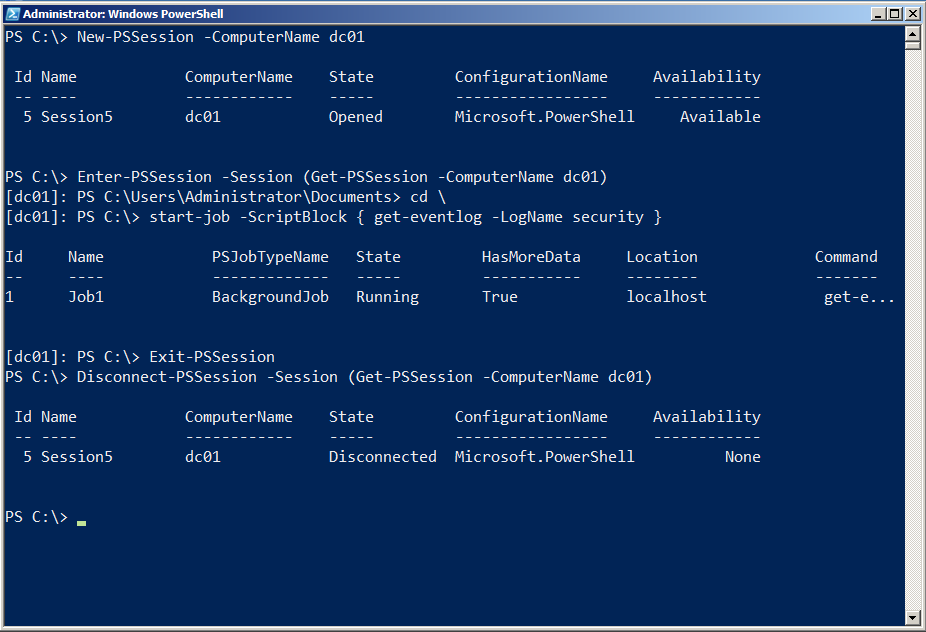
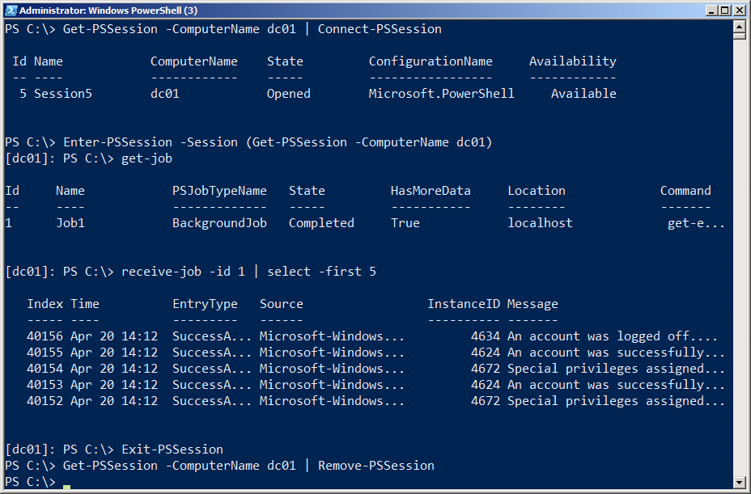
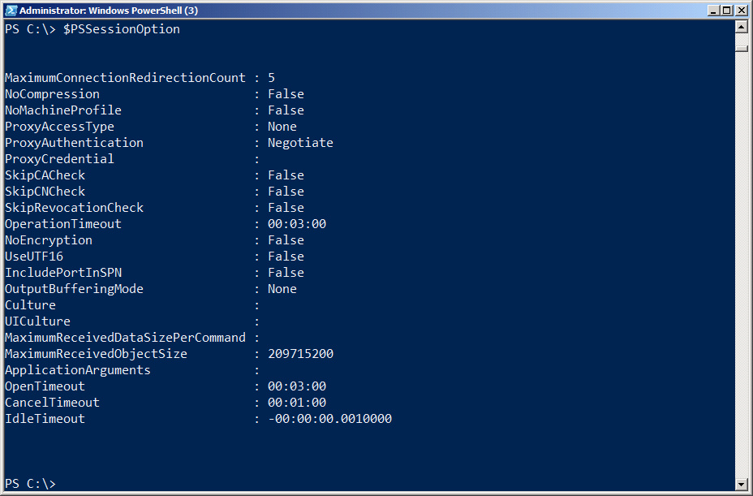
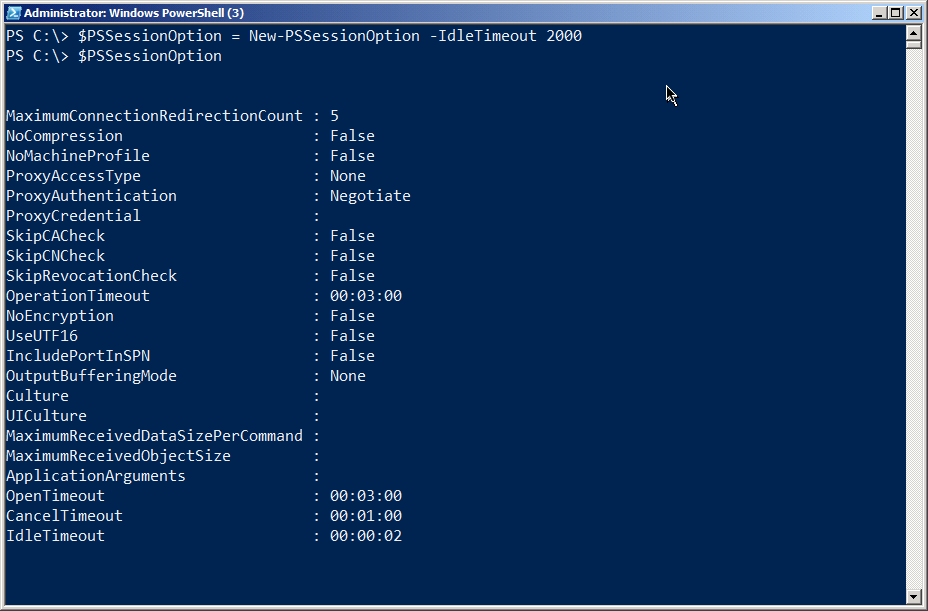
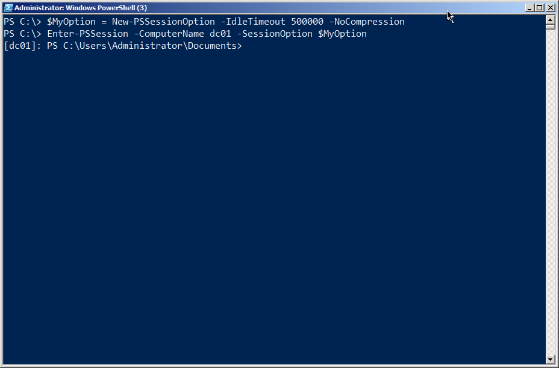

# Gestión de sesiones

Cuando crea una conexión Remoting entre dos máquinas, está creando una sesión en la terminología de PowerShell. Hay un número increíble de opciones que se pueden aplicar a estas sesiones, y en esta parte de la guía los guiaremos a través de ellas.

## Sesiones Ad-Hoc vs. Persistentes

Cuando utiliza un comando Remoting, principalmente Invoke-Command o Enter-PSSession, y especifica un nombre de equipo utilizando su parámetro -ComputerName, está creando una sesión Ad Hoc. Básicamente, PowerShell crea una sesión, la utiliza, y luego ejecuta sus comandos, todo de forma automática.

De manera alternativa, puede utilizar New-PSSession para crear explícitamente una nueva sesión, que luego puede utilizarse pasándola como el parámetro -Session de Invoke-Command, Enter-PSSession y muchos otros comandos compatibles con Remoting. Cuando crea manualmente una sesión, es su responsabilidad deshacerse de ella cuando haya terminado de utilizarla. Sin embargo, si tiene una sesión abierta y cierra su instancia de PowerShell, esa sesión se eliminará automáticamente por usted, por lo que no estaría dejando nada pendiente que necesita ser limpiado.

## Desconexión y Reconexión de Sesiones

En PowerShell v3, puede desconectar y volver a conectar sesiones utilizando Disconnect-PSSession y Connect-PSSession. Estos comandos aceptan cada uno un objeto de sesión, que normalmente crearía con New-PSSession.

Una sesión desconectada deja una copia de PowerShell en funcionamiento en el equipo remoto. Esta es una buena manera de ejecutar una tarea de larga duración, desconectarse y luego volver a conectarse más tarde para comprobar su estado. Incluso puede desconectar una sesión en una computadora, moverse a otra computadora y volver a conectarse a esa sesión \(aunque no puede conectarse a la sesión desconectada de otro usuario porque está limitado a volver a conectarse a la suya\).

Por ejemplo, la figura 5.1 muestra una sesión que se está creando desde un cliente a un servidor. A la sesión se le asigna una tarea para realizarla como un trabajo de fondo y, a continuación, se desconecta la sesión. Es importante tener en cuenta que el comando y el trabajo de fondo están en el servidor \(DC01\), no en el cliente.

Figura 5.1: Creación, uso y desconexión de una sesión

En la figura 5.2, nos hemos trasladado a una máquina diferente. Hemos iniciado sesión y ejecutado PowerShell, como el mismo usuario que estábamos en el equipo cliente anterior. Recuperamos la sesión desde el equipo remoto y la reconectamos. Luego entramos en la sesión conectada  nuevamente, mostramos ese trabajo en segundo plano y recibimos algunos resultados del mismo. Finalmente, salimos de la sesión remota y “apagamos la sesión” mediante Remove-PSSession.

Figura 5.2: Reconectar, utilizar y eliminar una sesión

Obviamente, las sesiones desconectadas pueden ser un reto para los procesos de administración, porque está dejando una copia de PowerShell en funcionamiento en una máquina remota y lo está haciendo de una manera que se hace difícil para alguien “verle”. Ahí es donde entran en juego las opciones de sesión.

## Opciones de Sesión

Cada vez que ejecuta un comando Remoting que crea una sesión, ya sea persistente o Ad Hoc, tiene la opción de especificar un parámetro -SessionOption que acepte un objeto PSSessionOption. El objeto de opción predeterminado se utiliza si no especifica uno, y ese objeto se puede encontrar en la variable global $PSSessionOption. Se muestra en la figura 5.3.

Figura 5.3: El objeto PSSessionOption predeterminado almacenado en $PSSessionOption

Como se puede ver, especifica un número de valores predeterminados, incluyendo el tiempo de espera de la operación, el tiempo de espera inactivo y otras opciones. Puede cambiar estos valores simplemente creando un nuevo objeto de opción de sesión y asignándolo a $PSSessionOption. Tenga en cuenta que debe realizar esto en una secuencia de comandos de perfil si desea que los cambios se conviertan en el nuevo valor predeterminado cada vez que abra una nueva copia de PowerShell. La figura 5.4 muestra un ejemplo..

Figura 5.4: Creación de un nuevo objeto PSSessionOption predeterminado

Por supuesto, un tiempo de inactividad de 2 segundos probablemente no es muy práctico (y de hecho no funcionará) por lo que debería especificar al menos un tiempo de espera de 60 segundos para lograr utilizar el objeto de sesión). Sin embargo, notará que sólo es necesario especificar los parámetros de opción que desea cambiar. Todo lo demás se establecerá a sus valores predeterminados. También puede especificar una opción de sesión única para cada sesión que cree. La figura 5.5 muestra una forma de hacerlo.

Figura 5.5: Creación de un nuevo objeto PSSessionOption para usar con una conexión 1-a-1

Mediante la especificación de valores convenientes para estas opciones, puede ayudar a garantizar que las sesiones desconectadas no se cierren y funcionen de manera adecuada. Un tiempo de espera de inactividad razonable, por ejemplo, asegura que la sesión acabará cerrándose, incluso si un administrador se desconecta y posteriormente se olvida de ella. Tenga en cuenta que cuando se cierra una sesión, se perderán todos los datos de esa sesión, incluidos los resultados de los trabajos en segundo plano. Probablemente sea una buena idea adoptar alguna practica para guardar datos en un archivo (por ejemplo, utilizando Export-CliXML, por ejemplo), para que una sesión inactiva no se cierre y se pierda todo su trabajo.

