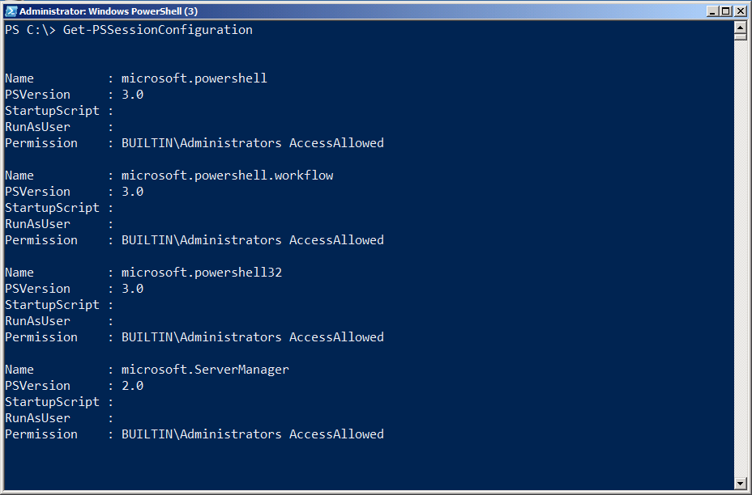
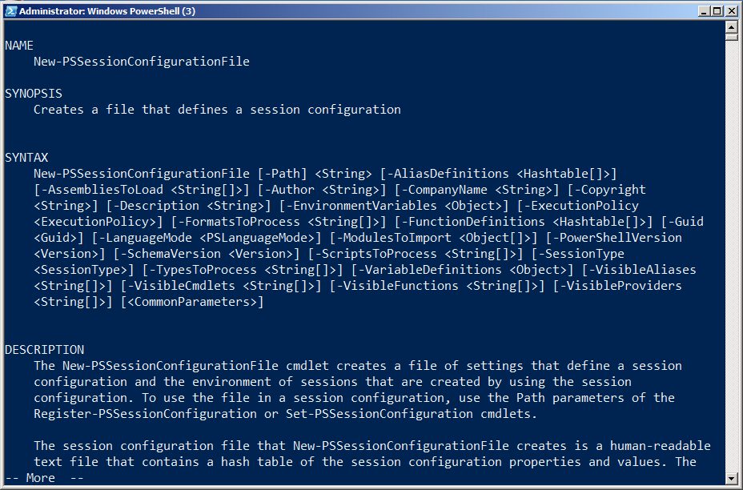
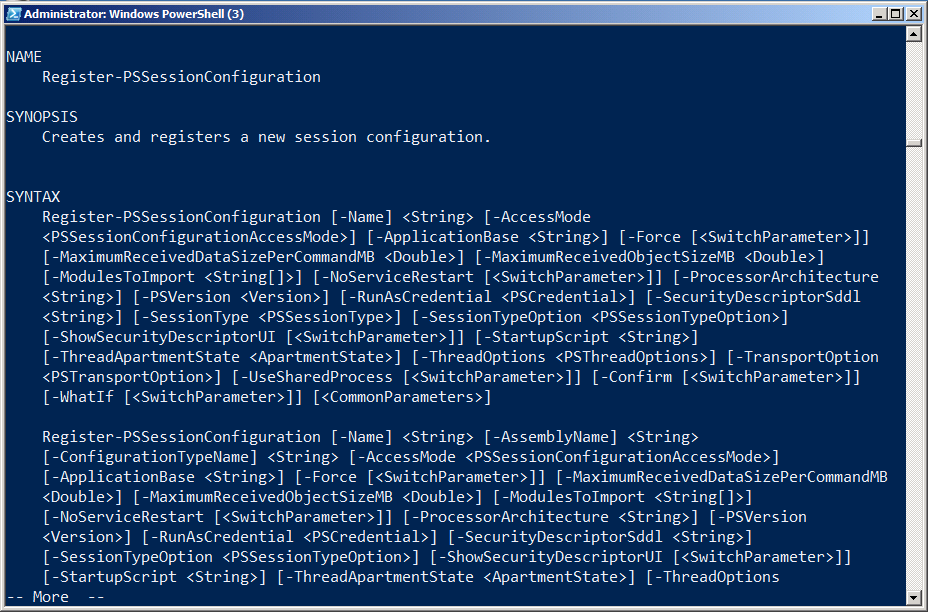
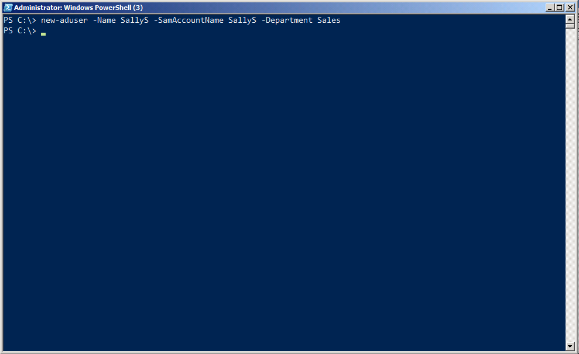
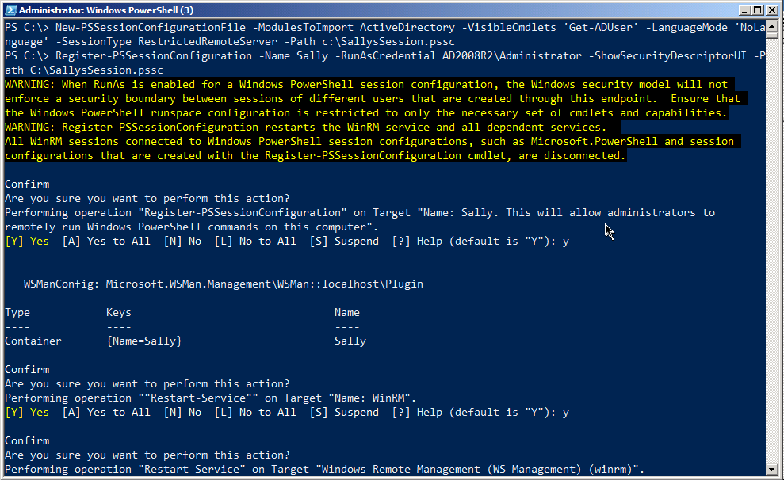
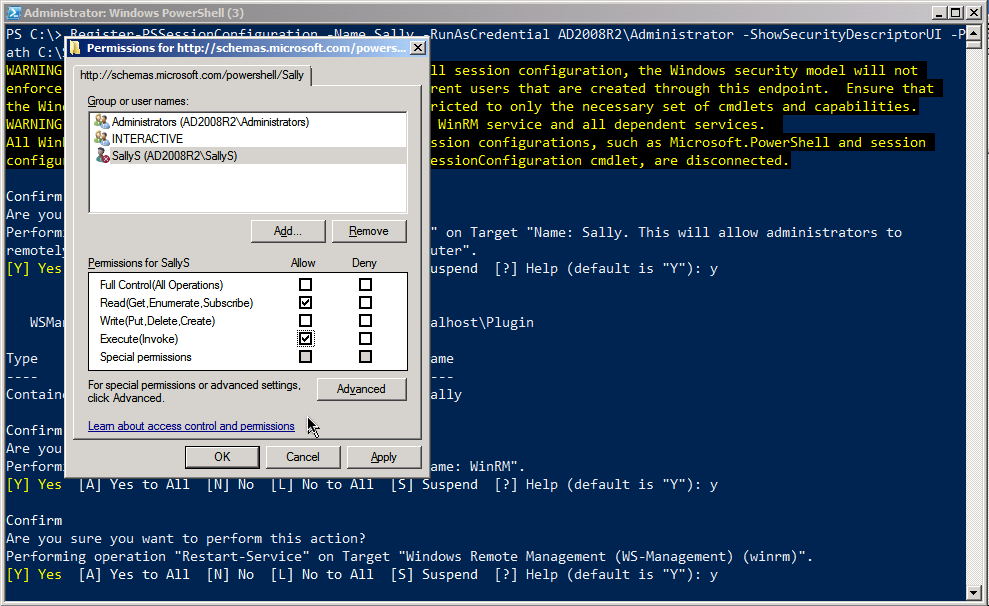
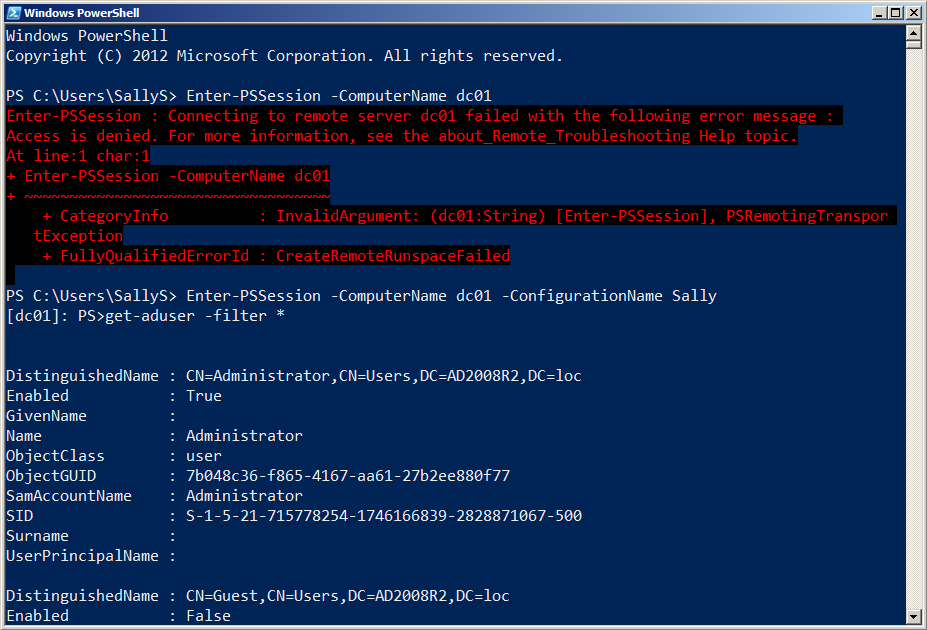
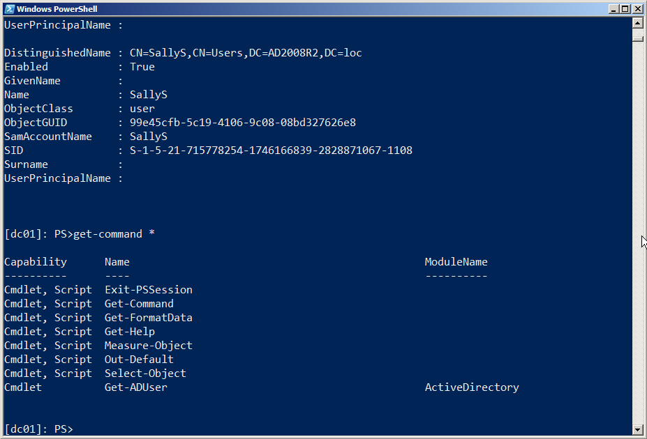

# Trabajar con Endpoints (también conocido como Configuraciones de Sesión)

Como aprendió al principio de esta guía, Remoting está diseñado para trabajar con múltiples puntos finales distintos en un equipo. En la terminología de PowerShell, cada punto final es una configuración de sesión o simplemente una configuración. Cada uno puede ser configurado para ofrecer servicios y capacidades específicos, así como tener restricciones y limitaciones específicas.

## Conexión a un punto final diferente

Cuando utiliza un comando como Invoke-Command o Enter-PSSession, normalmente se conecta al punto final predeterminado de un equipo remoto. Eso es lo que hemos hecho hasta ahora. Pero puede ver los otros puntos finales habilitados ejecutando Get-PSSessionConfiguration, como se muestra en la figura 3.1.



Figura 3.1: Listando los puntos finales instalados

**Nota:** Como señalamos en un capítulo anterior, cada computadora mostrará puntos finales diferentes por defecto. Nuestra salida era de un equipo con Windows Server 2008 R2, que tiene menos puntos finales predeterminados que, por ejemplo, un equipo con Windows 2012.

Cada punto final tiene un nombre, como "Microsoft.PowerShell" o "Microsoft.PowerShell32". Para conectarse a un punto final específico, agregue el parámetro -ConfigurationName al comando Remoting, como se muestra en la Figura 3.2.


Figura 3.2: Conexión a una configuración específica (punto final) por nombre

## Creación de un punto de extremo personalizado

Existen varias razones para crear un punto final personalizado (o una configuración):

- Puede tener scripts y módulos de carga automática cada vez que alguien se conecta.
- Puede especificar un descriptor de seguridad (SDDL) que determina quién tiene permiso para conectarse.
- Puede especificar una cuenta alternativa que se utilizará para ejecutar todos los comandos dentro del punto final, en lugar de utilizar las credenciales de los usuarios conectados.
- Puede limitar los comandos que están disponibles para los usuarios conectados, restringiendo así sus capacidades.

Hay dos pasos para configurar un punto final: Crear un archivo de configuración de sesión que definirá las capacidades de los puntos finales y luego registrar ese archivo, que habilita el punto final y define sus configuraciones. La Figura 3.3 muestra la ayuda para el comando New-PSSessionConfigurationFile, que realiza el primero de estos dos pasos.



Figura 3.3: El comando New-PSSessionConfigurationFile

Aquí algunos de los parámetros que le permiten especificar (revise el archivo de ayuda por los otros parámetros):

- -Path: El único parámetro obligatorio, es la ruta y el nombre de archivo del archivo de configuración que creará. Ingrese un nombre y utilice una extensión .PSSC para el nombre de archivo.

- -AliasDefinitions: Esta es una tabla hash de alias y sus definiciones. Por ejemplo, @ {Name = 'd'; Definition = 'Get-ChildItem'; Options = 'ReadOnly'} definiría el alias d. Utilice una lista separada por comas de estas tablas hash para definir varios alias.

- -EnvironmentVariables: Una tabla hash única de variables de entorno para cargar en el punto final: @{'MyVar'='\SERVER\Share';'MyOtherVar'='SomethingElse'}

- -ExecutionPolicy: Por defecto es Restricted si no especifica otra cosa. Utilice Unrestricted, AllSigned o RemoteSigned. Establece la directiva de ejecución de secuencias de comandos para el punto final.

- -FormatsToProcess y -TypesToProcess: Cada una de estas es una lista separada por comas de la ruta de acceso y los nombres de los archivos a cargar. El primero especifica los archivos .format.ps1xml que contienen definiciones de vista, mientras que el segundo especifica un archivo .ps1xml para el ETS (Extensible Type System) de PowerShell.

- -FunctionDefinitions: Una lista separada por comas de tablas hash, cada una de las cuales define una función para aparecer dentro del punto final. Por ejemplo,  @{Name='MoreDir';Options='ReadOnly';Value={ Dir | more }}

- -LanguageMode: El modo para el lenguaje de script de PowerShell. "FullLanguage" y "NoLanguage" son las opciones. Este último sólo permite ejecutar funciones y Cmdlets. También hay "RestrictedLanguage" que permite un subconjunto muy pequeño del lenguaje de scripting para trabajar - vea la ayuda para más detalles.

- -ModulesToImport: Una lista de nombres de módulos separados por comas para cargar en el punto final. También puede utilizar tablas hash para especificar versiones de módulo específicas. Lea la ayuda completa del comando para obtener más detalles.

- -PowerShellVersion: '2.0' o '3.0', especifica la versión de PowerShell que desea que el punto final utilice. 2.0 sólo se puede especificar si PowerShell v2 se instala independientemente en el equipo que aloja el punto final (instalando v3 "en la parte superior de" v2 permite que v2 continúe existiendo).

- -ScriptsToProcess: Una lista separada por comas de nombres de rutas y archivos de secuencias de comandos que se ejecutan cuando un usuario se conecta al punto final. Puede usar esto para personalizar el espacio de ejecución del punto final, definir funciones, cargar módulos o hacer cualquier otra cosa que un script pueda hacer. Sin embargo, para ejecutar la directiva de ejecución de secuencias de comandos debe permitir la secuencia de comandos.

- -SessionType: " Empty " no carga nada por defecto, dejándolo a usted libre de cargar lo que quiera a través de scripts o los parámetros de este comando. "Default" carga las extensiones principales de PowerShell normales, además de cualquier otra cosa que haya especificado a través del parámetro. "RestrictedRemoteServer" agrega una lista fija de siete comandos, además de lo que haya especificado. Consulte la ayuda para obtener detalles sobre lo que se ha cargado

**Precaución**: Algunos comandos son importantes, como Exit-PSSession, que permite a alguien salir de forma limpia de una sesión de Remoting interactiva. RestrictedRemoteServer carga estos, pero Empty no.

-VisibleAliases, -VisibleCmdlets, -VisibleFunctions y -VisibleProviders: estas listas separadas por comas definen cuáles de los alias, cmdlets, funciones y PSProviders disponibles serán visibles para el usuario del punto final. Estos le permiten cargar un módulo completo, pero sólo exponen uno o dos comandos, si lo desea.

**Nota:** No puede utilizar un punto de terminación personalizado solo para controlar los parámetros a los que un usuario tendrá acceso. Si necesita ese nivel de control, una opción es sumergirse en la programación de .NET Framework, lo que le permite crear una configuración remota más fina. Eso está más allá del alcance de esta guía. También puede crear un punto de extremo personalizado que sólo incluya funciones de proxy, otra forma de "integrar" comandos incorporados y agregar o eliminar parámetros, pero eso también está fuera del alcance de esta guía.

Una vez que haya creado el archivo de configuración, estará listo para registrarlo. Esto se hace con el comando Register-PSSessionConfiguration, como se muestra en la figura 3.4.



Figura 3.4: El comando Register-PSSessionConfiguration

Como puede ver, hay mucho que hacer con este comando. Algunos de los parámetros más interesantes son:

- -RunAsCredential: Permite especificar una credencial que se utilizará para ejecutar todos los comandos dentro del punto final. Proporcionar esta credencial permite a los usuarios conectarse y ejecutar comandos que normalmente no tendrían permiso para ejecutarse. Limitando los comandos disponibles (a través del archivo de configuración de sesión), puede restringir lo que los usuarios pueden hacer con este privilegio elevado.

- -SecurityDescriptorSddl: Le permite especificar quién puede conectarse al punto final. El lenguaje de especificación es complejo. Considere el uso de -ShowSecurityDescriptorUI en su lugar, que muestra un cuadro de diálogo gráfico para establecer los permisos de punto final.

- -StartupScript: Especifica un script para ejecutarse cada vez que se inicia el punto final.

Puede explorar las otras opciones por su cuenta en el archivo de ayuda. Echemos un vistazo a la creación y el uso de uno de estos extremos personalizados. Como se muestra en la figura 3.5, hemos creado una nueva cuenta de usuario de AD para SallyS del departamento de ventas. Sally, por alguna razón, debe ser capaz de enumerar a los usuarios en nuestro dominio de AD - pero eso es todo lo que debe ser capaz de hacer. Su cuenta no tiene permiso para hacerlo.



Figura 3.5: Creación de una nueva cuenta de usuario de AD para la prueba

La Figura 3.6 muestra la creación del nuevo archivo de configuración de la sesión y el registro de la sesión. Observe que la sesión importará automáticamente el módulo ActiveDirectory, pero sólo hará que el cmdlet Get-ADUser sea visible para Sally. Hemos especificado un tipo de sesión remota restringida, que proporcionará algunos otros comandos clave a Sally. También desactivamos el lenguaje de scripting de PowerShell. Al registrar la configuración, especificamos una credencial "Ejecutar como" (se nos pidió la contraseña), que es la cuenta bajo la qie que todos los comandos ejecutarán.



Figura 3.6: Creación y registro del nuevo punto final

Debido a que usamos el parámetro "ShowSecurityDescriptorUI", tenemos un cuadro de diálogo como el que se muestra en la figura 3.7. Esta es una manera más fácil de establecer los permisos para quién puede usar este nuevo punto final. Tenga en cuenta que el punto final ejecutará los comandos bajo una cuenta de administrador de dominio, por lo que debemos tener mucho cuidado de a quien realmente dejamos ingresar. Sally necesita, como mínimo, permiso de ejecución y lectura, que ya se le ha dado.



Figura 3.7: Configuración de los permisos en el punto final

A continuación, establecer una contraseña para Sally y activar su cuenta de usuario. Todo hasta este punto se ha hecho en el ordenador DC01.AD2008R2.loc. La figura 3.8 se desplaza al equipo cliente de Windows 7 de ese dominio, donde iniciamos sesión con la cuenta de Sally. Como puede ver, no pudo ingresar a la sesión predeterminada en el controlador de dominio. Pero cuando intentó entrar en la nueva sesión especial que creamos sólo para ella, la operación tuvo éxito. También pudo ejecutar Get-ADUser.



Figura 3.8: Prueba del nuevo punto final iniciando sesión como Sally

La Figura 3.9 confirma que Sally tiene un número muy limitado de comandos para ejecutar. Algunos de estos comandos, como Get-Help y Exit-PSSession, son muy importantes para usar el punto final. Otros, como Select-Object, le dan a Sally una cantidad mínima de comodidad no destructiva para que su salida de comandos se vea como ella necesita. Esta lista de comandos (aparte de Get-ADUser) se establece automáticamente cuando se especifica el tipo de sesión "restricted remote" en el archivo de configuración de la sesión.



Figura 3.9: Solamente ocho comandos, incluido el Get-ADUser que hemos agregado, están disponibles dentro del punto final.

En realidad, es poco probable que un usuario de ventas como Sally estuviera ejecutando comandos en la consola de PowerShell. Lo más probable es que utilizara alguna aplicación basada en GUI que ejecutara los comandos "detrás de escenas". De cualquier manera, nos hemos asegurado de que ella tiene exactamente la funcionalidad que necesita para hacer su trabajo, y nada más.

## Precauciones de seguridad con puntos finales personalizados

Cuando crea un archivo de configuración de sesión personalizado, tal como lo ha visto, puede configurar su modo de idioma. El modo de idioma determina qué elementos del lenguaje de secuencias de comandos de PowerShell están disponibles en el punto final y el modo de lenguaje puede ser como una laguna. Con el modo de lenguaje "Full", obtendrá todo el lenguaje de secuencias de comandos, incluidos los bloques de secuencia de comandos. Un bloque de secuencia de comandos es cualquier trozo ejecutable de código de PowerShell contenido dentro de {curly brackets}. Ellos son la escapatoria. Siempre que permita el uso de bloques de script, puede ejecutar cualquier comando legal, incluso si su punto final usó -VisibleCmdlets o -VisibleFunctions u otro parámetro para limitar los comandos en el punto final.

En otras palabras, si registra un punto final que utiliza -VisibleCmdlets para exponer sólo Get-ChildItem, pero crea el archivo de configuración de sesión del punto final para que tenga el modo de lenguaje Full, cualquier bloque de secuencia dentro del punto final puede utilizar cualquier comando. Alguien podría ejecutar:

````
PS C:\> & { Import-Module ActiveDirectory; Get-ADUser -filter \* | Remove-ADObject }
````

¡Eek! Esto puede ser especialmente peligroso si ha configurado el punto final para utilizar una credencial de RunAs para ejecutar comandos bajo privilegios elevados. También es algo fácil dejar que esto suceda por error, ya que se establece el modo de idioma cuando se crea el nuevo archivo de configuración de sesión (New-PSSessionConfigurationFile), no cuando se registra la sesión (Register-PSSessionConfiguration). Por lo tanto, si está utilizando un archivo de configuración de sesión creado por otra persona, abra y confirme su modo de idioma antes de usarlo.

Puede evitar este problema estableciendo el modo de idioma en NoLanguage, que deshabilita los bloques de secuencia de comandos y el resto del lenguaje de secuencias de comandos. O bien, vaya a RestrictedLanguage, que bloquea bloques de secuencia de comandos al mismo tiempo que permite el uso de algunos operadores básicos si desea que los usuarios del punto final puedan hacer filtrado y comparaciones básicas.

Es importante distinguir que esto no es un error, pues el comportamiento que estamos describiendo aquí es por diseño. Puede ser un problema si no lo sabe o no entiende lo que está haciendo.

Nota: Muchas gracias al compañero MVP Aleksandar Nikolic por ayudarme a entender la lógica de esta laguna!


